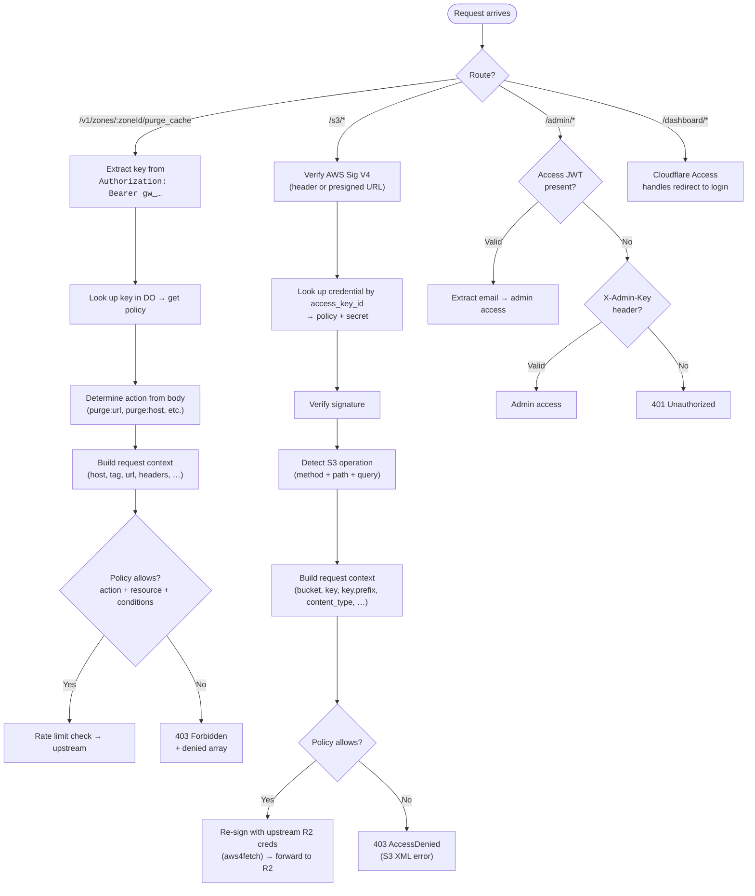

# Gatekeeper

API gateway on Cloudflare Workers with an AWS IAM-style authorization engine. Fronts the Cloudflare cache purge API and Cloudflare R2 (S3-compatible storage). The IAM layer is service-agnostic — the same policy engine handles both services.

## What it does

1. **IAM policy engine** — fine-grained access control via policy documents. Each API key or S3 credential has an attached policy with actions, resources, and conditions (field/operator/value expressions). Think IAM policies, not flat RBAC.
2. **S3/R2 proxy** — S3-compatible gateway to Cloudflare R2 with per-credential IAM policies. R2's native tokens only support per-bucket read/write — this adds object-level, key-prefix, cross-bucket, and conditional access control. Standard S3 clients (rclone, boto3, aws-cli) work out of the box.
3. **Rate limit headers** — the purge endpoint doesn't return any. This gateway adds `Ratelimit` and `Ratelimit-Policy` (IETF Structured Fields format) so clients know their budget.
4. **Token bucket enforcement** — rejects purge requests client-side before they hit the upstream API. Two buckets: bulk (50/sec, burst 500) and single-file (3,000 URLs/sec, burst 6,000). Enterprise tier defaults.
5. **Request collapsing** — identical concurrent purges get deduplicated at both isolate and Durable Object levels. Only the leader consumes a rate limit token.
6. **Analytics** — every purge and S3 operation is logged to D1. Query events, get summaries, filter by key/credential/zone/bucket/time range.
7. **Dashboard** — Astro SPA served from the same Worker via Static Assets. Overview, key management, S3 credentials, upstream token/R2 management, settings, analytics, manual purge.

## Architecture

```mermaid
flowchart TB
    subgraph Clients
        svc["Service / CI&#8239;/&#8239;CD<br/><code>Authorization: Bearer gw_…</code>"]
        human["Browser<br/><code>CF_Authorization</code> cookie"]
        s3c["S3 Client (rclone, boto3)<br/>AWS Sig V4 with GK credentials"]
    end

    subgraph CF["Cloudflare Edge"]
        access["Cloudflare Access<br/><i>identity — who are you?</i><br/>gates /admin/* and /dashboard/*"]
    end

    subgraph Worker["API Gateway Worker"]
        direction TB
        mw["Security Headers Middleware"]

        subgraph Auth["Authentication"]
            jwt["Access JWT<br/>validator"]
            adminkey["Admin Key<br/>HMAC check"]
            sigv4["Sig V4<br/>verifier"]
        end

        iam["IAM Policy Engine<br/><i>authorization — what can you do?</i>"]

        subgraph Handlers["Service Handlers"]
            purge["Purge Handler<br/><code>/v1/zones/:id/purge_cache</code>"]
            s3h["S3 Proxy Handler<br/><code>/s3/*</code>"]
            admin["Admin API<br/><code>/admin/*</code>"]
        end
    end

    subgraph DO["Durable Object (SQLite)"]
        tb["Token Buckets<br/><i>in-memory, lazy refill</i>"]
        keys["Purge Keys"]
        creds["S3 Credentials"]
        upt["Upstream Tokens"]
        upr2["Upstream R2 Endpoints"]
        cfg["Config Registry"]
        collapse["Request Collapsing"]
    end

    d1[("D1<br/>Analytics")]
    assets["Static Assets<br/>Dashboard SPA"]

    subgraph Upstream["Upstream Services"]
        cfapi["api.cloudflare.com<br/><code>/purge_cache</code>"]
        r2api["R2 S3 API<br/><i>re-signed via aws4fetch</i>"]
    end

    svc --> mw
    human --> access --> mw
    s3c --> mw
    mw --> Auth
    Auth --> iam
    iam --> Handlers
    purge --> DO
    s3h --> DO
    admin --> DO
    purge --> d1
    s3h --> d1
    DO --> cfapi
    DO --> r2api
    human --> assets
```



**Identity vs Authorization:** Two separate concerns, deliberately decoupled. Cloudflare Access handles identity (who are you?) via JWT. The IAM engine handles authorization (what can you do?) via policy documents attached to API keys or S3 credentials. Machine clients authenticate via API key (purge) or AWS Sig V4 (S3) and skip Access entirely. Humans authenticate via Access and get implicit admin authorization.

**One DO for the whole gateway.** Holds purge rate limit buckets, purge API keys, S3 credentials, upstream CF API tokens, and upstream R2 endpoints — all in SQLite. The DO soft limit is ~1,000 RPS, well above the Enterprise purge ceiling. S3 credentials and upstream registries use a 60-second in-memory cache for the hot auth path.

**Token bucket is in-memory only.** Not persisted to DO SQLite. If the DO evicts, the bucket resets to full — that's fine, the upstream API is the real enforcer.

---

## Setup

Requires Node.js >= 18 and a Cloudflare account with an API token that has Cache Purge permission.

```bash
git clone https://github.com/erfianugrah/gatekeeper.git
cd gatekeeper
npm install
cd dashboard && npm install && cd ..
```

### Configure `wrangler.jsonc`

1. **Custom domain** — change `gate.erfi.io` to your domain, or remove the `routes` block for `*.workers.dev`:

   ```jsonc
   "routes": [{ "pattern": "purge.yourdomain.com", "custom_domain": true }]
   ```

2. **D1 database** — create one and update the binding:

   ```bash
   npx wrangler d1 create gatekeeper-analytics
   # copy the database_id into wrangler.jsonc
   ```

   The D1 database stores purge and S3 analytics events. It's the only external binding besides the Durable Object.

3. **Rate limits and other settings** — defaults target the Cloudflare Enterprise purge tier. You don't need to change anything in `wrangler.jsonc`. All tunable settings live in the config registry (see [Configuration](#configuration)) and can be changed at runtime without redeploying.

### Secrets

Local dev — create `.dev.vars`:

```
ADMIN_KEY=<a-strong-secret-for-admin-operations>
```

That's the only required secret. The admin key authenticates CLI and API calls to `/admin/*` routes.

Production:

```bash
npx wrangler secret put ADMIN_KEY
```

Optional (for Cloudflare Access identity on the dashboard):

```bash
npx wrangler secret put CF_ACCESS_TEAM_NAME
npx wrangler secret put CF_ACCESS_AUD
```

### Upstream credentials

Upstream Cloudflare API tokens and R2 endpoint credentials are **not** env vars. They're registered at runtime via the admin API and stored in the Durable Object's SQLite database. This lets you manage multiple upstream tokens with different zone/bucket scopes, rotate credentials without redeploying, and audit who registered what.

Register a CF API token for purge:

```bash
gk upstream-tokens create \
  --name "prod-purge" \
  --token "<your-cloudflare-api-token>" \
  --zone-ids "<zone-id>"        # or "*" for all zones
```

Register an R2 endpoint for the S3 proxy:

```bash
gk upstream-r2 create \
  --name "prod-r2" \
  --access-key-id "<r2-access-key>" \
  --secret-access-key "<r2-secret-key>" \
  --r2-endpoint "https://<account_id>.r2.cloudflarestorage.com" \
  --bucket-names "*"            # or "bucket1,bucket2"
```

Token/secret values are write-only — they can't be retrieved after registration. Each upstream has a scope (zone IDs or bucket names). When a purge or S3 request arrives, the gateway resolves the best matching upstream: exact match preferred over wildcard.

### Dev / Build / Deploy

```bash
npm run dev              # wrangler dev (local)
npm run build            # build dashboard + CLI
npm run deploy           # build dashboard, then wrangler deploy
npm test                 # run all tests (551 across worker + CLI)
npm run test:worker      # worker tests only
npm run test:cli         # CLI tests only
npx wrangler types       # regenerate types after changing wrangler.jsonc
npm run preflight        # typecheck + lint + test + build (full CI check)
npm run ship             # preflight + deploy
npm run smoke            # E2E smoke tests against a live instance
```

On first deploy, wrangler creates the DO namespace and runs the SQLite migration automatically.

---

## Configuration

All gateway settings live in the **config registry** — a SQLite table inside the Durable Object. No env vars, no redeployment needed. Changes take effect immediately (the DO rebuilds its token buckets on write).

### Resolution order

When the gateway needs a config value, it checks these sources in order:

1. **Registry override** (DO SQLite) — highest priority. Set via `PUT /admin/config` or `gk config set`.
2. **Hardcoded default** — baked into the source code. You get these if you've never touched the registry.

### Config keys

| Key                  | Default | What it does                                                                      |
| -------------------- | ------- | --------------------------------------------------------------------------------- |
| `bulk_rate`          | `50`    | Bulk purge token refill rate (tokens/sec). Enterprise tier.                       |
| `bulk_bucket_size`   | `500`   | Bulk purge burst capacity (max tokens in the bucket at any time).                 |
| `bulk_max_ops`       | `100`   | Max items in a single bulk purge request (hosts, tags, prefixes).                 |
| `single_rate`        | `3000`  | Single-file purge token refill rate (URLs/sec). Enterprise tier.                  |
| `single_bucket_size` | `6000`  | Single-file purge burst capacity.                                                 |
| `single_max_ops`     | `500`   | Max URLs in a single purge-by-URL request.                                        |
| `key_cache_ttl_ms`   | `60000` | How long the DO caches API key and S3 credential lookups (milliseconds).          |
| `retention_days`     | `30`    | D1 analytics retention. A daily cron at 03:00 UTC deletes events older than this. |

### Viewing and changing config

**Dashboard:** go to `/dashboard/settings`. Every key shows its current value, the default, whether it's overridden, and who changed it last. Click "Edit" on any row, type the new value, hit Save. Click "Reset" to revert an override back to the hardcoded default.

**CLI:**

```bash
gk config get                           # show all keys with source info
gk config set --key bulk_rate --value 100
gk config reset --key bulk_rate          # revert to default (50)
```

**API:**

```bash
# Get full config (resolved values + overrides + defaults)
curl -H "X-Admin-Key: $ADMIN_KEY" https://gate.example.com/admin/config

# Set one or more values
curl -X PUT -H "X-Admin-Key: $ADMIN_KEY" \
     -H "Content-Type: application/json" \
     -d '{"bulk_rate": 100, "retention_days": 14}' \
     https://gate.example.com/admin/config

# Reset a single key to its default
curl -X DELETE -H "X-Admin-Key: $ADMIN_KEY" \
     https://gate.example.com/admin/config/bulk_rate
```

The `GET /admin/config` response includes three objects: `config` (fully resolved values), `overrides` (only the keys you've explicitly set, with timestamps and who set them), and `defaults` (the hardcoded fallbacks). The dashboard Settings page renders all three.

---

## IAM Policy Engine

Each API key has a policy document — a JSON structure with statements, modeled after AWS IAM.

### Concepts

| Concept       | AWS IAM equivalent        | Our system                                                             |
| ------------- | ------------------------- | ---------------------------------------------------------------------- |
| **Principal** | IAM user / role           | API key holder (key ID) or Access-authenticated user (email)           |
| **Action**    | `s3:GetObject`            | `purge:url`, `purge:host`, `purge:tag`, `s3:GetObject`, `s3:PutObject` |
| **Resource**  | `arn:aws:s3:::bucket/*`   | `zone:<zone-id>`, `bucket:<name>`, `object:<bucket>/<key>`             |
| **Condition** | `StringLike`, `IpAddress` | Expression engine: `eq`, `contains`, `starts_with`, `matches`, etc.    |
| **Effect**    | Allow / Deny              | Allow / Deny. Explicit deny overrides allow (standard IAM precedence). |
| **Policy**    | IAM policy document       | JSON document with statements, attached to API keys                    |

### Policy document

```json
{
	"version": "2025-01-01",
	"statements": [
		{
			"effect": "allow",
			"actions": ["purge:host", "purge:tag"],
			"resources": ["zone:aaaa1111bbbb2222cccc3333dddd4444"],
			"conditions": [{ "field": "host", "operator": "ends_with", "value": ".example.com" }]
		}
	]
}
```

A key can have one policy document. The policy has one or more statements. Evaluation follows standard IAM precedence:

1. If **any** deny statement matches → **denied** (explicit deny always wins)
2. If **any** allow statement matches → **allowed**
3. If nothing matches → **denied** (implicit deny)

Within a single statement, **all** of the following must be true for it to match (AND):

1. The requested **action** matches one of the statement's actions
2. The targeted **resource** matches one of the statement's resources
3. **All** conditions evaluate to true against the request context

### Actions

Namespaced by service. Wildcard suffix supported (`purge:*` matches all purge actions).

**Purge service:**

| Action             | Description                              |
| ------------------ | ---------------------------------------- |
| `purge:url`        | Purge by URL(s) via `files[]`            |
| `purge:host`       | Purge by hostname(s) via `hosts[]`       |
| `purge:tag`        | Purge by cache tag(s) via `tags[]`       |
| `purge:prefix`     | Purge by URL prefix(es) via `prefixes[]` |
| `purge:everything` | Purge everything in a zone               |
| `purge:*`          | All purge actions                        |

**Admin service:**

| Action                 | Description         |
| ---------------------- | ------------------- |
| `admin:keys:create`    | Create API keys     |
| `admin:keys:list`      | List API keys       |
| `admin:keys:revoke`    | Revoke API keys     |
| `admin:keys:read`      | Read key details    |
| `admin:analytics:read` | Read analytics data |
| `admin:*`              | All admin actions   |

**S3/R2 service:**

| Action                        | Description                                              |
| ----------------------------- | -------------------------------------------------------- |
| `s3:GetObject`                | Read objects (also covers HeadObject)                    |
| `s3:PutObject`                | Write objects (also covers CopyObject, multipart upload) |
| `s3:DeleteObject`             | Delete objects (single and batch)                        |
| `s3:ListBucket`               | List bucket contents (v1 and v2)                         |
| `s3:ListAllMyBuckets`         | List all buckets                                         |
| `s3:CreateBucket`             | Create bucket                                            |
| `s3:DeleteBucket`             | Delete bucket                                            |
| `s3:AbortMultipartUpload`     | Abort multipart upload                                   |
| `s3:ListMultipartUploadParts` | List parts of a multipart upload                         |
| `s3:*`                        | All S3 actions (66 operations mapped)                    |

### Resources

Typed identifiers with optional wildcards.

| Pattern                    | Matches                                |
| -------------------------- | -------------------------------------- |
| `zone:<id>`                | Specific zone (purge service)          |
| `zone:*`                   | All zones                              |
| `bucket:<name>`            | Specific R2 bucket (S3 service)        |
| `bucket:staging-*`         | Buckets matching prefix                |
| `object:<bucket>/<key>`    | Specific object                        |
| `object:<bucket>/*`        | All objects in a bucket                |
| `object:<bucket>/public/*` | Objects under a key prefix             |
| `account:*`                | Account-level (ListBuckets)            |
| `*`                        | Everything (dangerous — use sparingly) |

Matching rules:

- Exact: `zone:abc` matches `zone:abc`
- Wildcard suffix: `zone:*` matches any zone, `bucket:prod-*` matches `bucket:prod-images`
- Universal: `*` matches any resource

### Condition operators

| Operator       | Types        | Description                                                                     |
| -------------- | ------------ | ------------------------------------------------------------------------------- |
| `eq`           | string, bool | Exact equality (case-sensitive)                                                 |
| `ne`           | string, bool | Not equal                                                                       |
| `contains`     | string       | Substring match                                                                 |
| `not_contains` | string       | Substring exclusion                                                             |
| `starts_with`  | string       | Prefix match                                                                    |
| `ends_with`    | string       | Suffix match                                                                    |
| `matches`      | string       | Regex match (max 256 chars, catastrophic backtracking rejected at key creation) |
| `not_matches`  | string       | Regex exclusion                                                                 |
| `in`           | string       | Value in a set (`{"value": ["a", "b"]}`)                                        |
| `not_in`       | string       | Value not in set                                                                |
| `wildcard`     | string       | Glob-style (`*` = any chars)                                                    |
| `lt`           | numeric      | Less than (both sides coerced to number; NaN → condition fails)                 |
| `gt`           | numeric      | Greater than                                                                    |
| `lte`          | numeric      | Less than or equal                                                              |
| `gte`          | numeric      | Greater than or equal                                                           |
| `exists`       | any          | Field is present                                                                |
| `not_exists`   | any          | Field is absent                                                                 |

### Condition fields (purge service)

| Field               | Source                            | Description                                             |
| ------------------- | --------------------------------- | ------------------------------------------------------- |
| `host`              | `hosts[]` item                    | Hostname in a bulk host purge                           |
| `tag`               | `tags[]` item                     | Cache tag in a bulk tag purge                           |
| `prefix`            | `prefixes[]` item                 | URL prefix in a bulk prefix purge                       |
| `url`               | `files[]` item (string or `.url`) | Full URL                                                |
| `url.path`          | Parsed from URL                   | Path component                                          |
| `url.query`         | Parsed from URL                   | Full query string                                       |
| `url.query.<param>` | Parsed from URL                   | Specific query parameter                                |
| `header.<name>`     | `files[].headers.<name>`          | Custom cache key header (e.g., `header.CF-Device-Type`) |
| `purge_everything`  | `purge_everything` field          | Boolean — is this purge-everything?                     |

**Request-level fields** (available on both purge and S3 requests):

| Field              | Source                    | Description                          |
| ------------------ | ------------------------- | ------------------------------------ |
| `client_ip`        | `CF-Connecting-IP` header | Client IP address                    |
| `client_country`   | `CF-IPCountry` header     | 2-letter ISO country code            |
| `client_asn`       | `request.cf.asn`          | Autonomous System Number (as string) |
| `time.hour`        | `Date.now()` at eval time | Hour of day, UTC (0–23)              |
| `time.day_of_week` | `Date.now()` at eval time | Day of week (0=Sun, 6=Sat)           |
| `time.iso`         | `Date.now()` at eval time | Full ISO-8601 timestamp              |

**S3/R2 service:**

| Field            | Source                  | Description                   |
| ---------------- | ----------------------- | ----------------------------- |
| `bucket`         | Parsed from path        | Bucket name                   |
| `key`            | Parsed from path        | Full object key               |
| `key.prefix`     | Derived from key        | Key prefix (up to last `/`)   |
| `key.filename`   | Derived from key        | Filename after last `/`       |
| `key.extension`  | Derived from key        | File extension                |
| `method`         | HTTP method             | `GET`, `PUT`, `DELETE`, etc.  |
| `content_type`   | `Content-Type` header   | MIME type                     |
| `content_length` | `Content-Length` header | Request body size             |
| `source_bucket`  | `x-amz-copy-source`     | Copy source bucket            |
| `source_key`     | `x-amz-copy-source`     | Copy source key               |
| `list_prefix`    | `?prefix=` query param  | List operations prefix filter |

The expression engine is **service-agnostic** — it evaluates conditions against a `Record<string, string | boolean | string[]>`. Each service handler is responsible for building the request context from the incoming request.

### Compound conditions

```json
{
	"conditions": [
		{
			"any": [
				{ "field": "host", "operator": "eq", "value": "a.example.com" },
				{ "field": "host", "operator": "eq", "value": "b.example.com" }
			]
		},
		{ "field": "url.path", "operator": "starts_with", "value": "/api/" }
	]
}
```

Top-level conditions: AND. `any: [...]`: OR. `all: [...]`: explicit AND. `not: {...}`: negation.

Most policies won't need compound conditions. Multiple statements with different conditions handle most OR cases naturally.

### Authorization flow



### Policy examples

**Wildcard — full access to one zone:**

```json
{
	"version": "2025-01-01",
	"statements": [
		{
			"effect": "allow",
			"actions": ["purge:*"],
			"resources": ["zone:aaaa1111bbbb2222cccc3333dddd4444"]
		}
	]
}
```

**CI/CD key — only purge tags matching a release pattern:**

```json
{
	"version": "2025-01-01",
	"statements": [
		{
			"effect": "allow",
			"actions": ["purge:tag"],
			"resources": ["zone:aaaa1111bbbb2222cccc3333dddd4444"],
			"conditions": [{ "field": "tag", "operator": "matches", "value": "^release-v[0-9]+\\.[0-9]+$" }]
		}
	]
}
```

**Scoped — only purge specific hosts by URL or tag:**

```json
{
	"version": "2025-01-01",
	"statements": [
		{
			"effect": "allow",
			"actions": ["purge:url", "purge:tag"],
			"resources": ["zone:aaaa1111bbbb2222cccc3333dddd4444"],
			"conditions": [
				{
					"any": [
						{ "field": "host", "operator": "eq", "value": "cdn.example.com" },
						{ "field": "host", "operator": "eq", "value": "static.example.com" }
					]
				}
			]
		}
	]
}
```

**Multi-zone with host restriction:**

```json
{
	"version": "2025-01-01",
	"statements": [
		{
			"effect": "allow",
			"actions": ["purge:url", "purge:host"],
			"resources": ["zone:*"],
			"conditions": [{ "field": "host", "operator": "ends_with", "value": ".example.com" }]
		}
	]
}
```

**S3 — read-only access to a bucket prefix:**

```json
{
	"version": "2025-01-01",
	"statements": [
		{
			"effect": "allow",
			"actions": ["s3:GetObject", "s3:ListBucket"],
			"resources": ["object:my-assets/public/*", "bucket:my-assets"],
			"conditions": [{ "field": "key.prefix", "operator": "starts_with", "value": "public/" }]
		}
	]
}
```

**S3 — full access to one bucket, read-only to another:**

```json
{
	"version": "2025-01-01",
	"statements": [
		{
			"effect": "allow",
			"actions": ["s3:*"],
			"resources": ["bucket:staging", "object:staging/*"]
		},
		{
			"effect": "allow",
			"actions": ["s3:GetObject", "s3:ListBucket"],
			"resources": ["bucket:production", "object:production/*"]
		}
	]
}
```

**S3 — restrict uploads by content type and key extension:**

```json
{
	"version": "2025-01-01",
	"statements": [
		{
			"effect": "allow",
			"actions": ["s3:PutObject"],
			"resources": ["object:media/*"],
			"conditions": [
				{ "field": "key.extension", "operator": "in", "value": ["jpg", "png", "webp"] },
				{ "field": "content_type", "operator": "starts_with", "value": "image/" }
			]
		}
	]
}
```

**Deny — full access but protect the vault bucket from deletion:**

```json
{
	"version": "2025-01-01",
	"statements": [
		{ "effect": "allow", "actions": ["s3:*"], "resources": ["*"] },
		{
			"effect": "deny",
			"actions": ["s3:DeleteObject", "s3:DeleteBucket"],
			"resources": ["bucket:vault", "object:vault/*"]
		}
	]
}
```

**Deny — block purge-everything while allowing all other purge operations:**

```json
{
	"version": "2025-01-01",
	"statements": [
		{ "effect": "deny", "actions": ["purge:everything"], "resources": ["*"] },
		{
			"effect": "allow",
			"actions": ["purge:*"],
			"resources": ["zone:aaaa1111bbbb2222cccc3333dddd4444"]
		}
	]
}
```

**IP restriction — only allow purge from specific countries:**

```json
{
	"version": "2025-01-01",
	"statements": [
		{
			"effect": "allow",
			"actions": ["purge:*"],
			"resources": ["zone:*"],
			"conditions": [{ "field": "client_country", "operator": "in", "value": ["US", "DE", "GB", "NL"] }]
		}
	]
}
```

**Time-based — restrict S3 writes to business hours (UTC):**

```json
{
	"version": "2025-01-01",
	"statements": [
		{
			"effect": "allow",
			"actions": ["s3:GetObject", "s3:ListBucket"],
			"resources": ["*"]
		},
		{
			"effect": "allow",
			"actions": ["s3:PutObject", "s3:DeleteObject"],
			"resources": ["*"],
			"conditions": [
				{ "field": "time.hour", "operator": "gte", "value": "9" },
				{ "field": "time.hour", "operator": "lt", "value": "17" },
				{
					"not": { "field": "time.day_of_week", "operator": "in", "value": ["0", "6"] }
				}
			]
		}
	]
}
```

### Regex safety

- Max pattern length: 256 characters
- Reject patterns with known catastrophic backtracking constructs (nested quantifiers: `(a+)+`, `(a*)*`)
- Compile with `new RegExp()` — catch syntax errors at key creation time, not at request time
- Cache compiled regexes per key in the DO (alongside the key cache, same 60s TTL)
- No lookbehind/lookahead (reject at validation)

### API key schema

```sql
CREATE TABLE api_keys (
  id TEXT PRIMARY KEY,                    -- random ID (e.g., gw_xxxxxxxxxxxx)
  key_hash TEXT NOT NULL UNIQUE,          -- HMAC-SHA256 hash of the key
  name TEXT NOT NULL,                     -- human-readable label
  policy TEXT NOT NULL,                   -- JSON policy document
  created_by TEXT,                        -- email from Access JWT (null if created via admin key)
  created_at TEXT NOT NULL DEFAULT (datetime('now')),
  expires_at TEXT,                        -- optional expiration
  revoked_at TEXT,                        -- null if active
  rate_limit INTEGER                      -- per-key rate limit override (req/sec), null = use default
);
```

Key prefix is `gw_*` (gateway). The old `pgw_*` prefix is no longer supported — all code referencing it has been removed.

### V1 scope system (removed)

The v1 scope system (`key_scopes` table, `KeyScope` type, `ScopeType` enum, `migrateV1Scopes()`, v1 RPC methods) has been completely removed. The project is not in production use yet, so no backward compatibility is needed. All keys now require a `policy: PolicyDocument` at creation time.

---

## API

Full spec: [`openapi.yaml`](openapi.yaml) (OpenAPI 3.1).

### `GET /health`

Returns `{"ok": true}`.

### `POST /v1/zones/:zoneId/purge_cache`

Proxies to the Cloudflare purge API. Same request body format. Requires `Authorization: Bearer gw_<key_id>`.

**Single-file** (1 token per URL from the `single` bucket):

```json
{ "files": ["https://example.com/page.html", "https://example.com/style.css"] }
```

Files can be objects: `{"url": "https://...", "headers": {"CF-Device-Type": "mobile"}}`

**Bulk** (1 token from the `bulk` bucket):

```json
{"hosts": ["example.com"]}
{"tags": ["product-page", "header"]}
{"prefixes": ["example.com/blog/"]}
{"purge_everything": true}
```

#### Cache key purging

Cloudflare purge-by-URL with custom cache keys requires passing headers in the `files` object:

```json
{
	"files": [
		{
			"url": "https://example.com/",
			"headers": {
				"CF-Device-Type": "mobile",
				"CF-IPCountry": "ES"
			}
		}
	]
}
```

Common cache key headers: `CF-Device-Type`, `CF-IPCountry`, `accept-language`, `Origin`.

The policy condition engine evaluates against headers and parsed URL components, not just the raw URL string. For `files[]` with multiple entries, each entry is evaluated independently — if **any** entry fails the policy check, the entire request is denied. For bulk types (`hosts[]`, `tags[]`, `prefixes[]`), each value in the array is evaluated as a separate context.

#### Response headers

```
Ratelimit: "purge-bulk";r=499;t=0
Ratelimit-Policy: "purge-bulk";q=500;w=10
```

IETF Structured Fields format. `r` = remaining, `t` = retry-after seconds, `q` = capacity, `w` = window. On 429, `Retry-After` is also set.

Non-200 responses from the upstream Cloudflare API (429, 500, etc.) are passed through with their original status code and body.

#### Errors

| Status | Cause                                                                             |
| ------ | --------------------------------------------------------------------------------- |
| 400    | Bad zone ID, invalid JSON, unrecognized body, oversized request                   |
| 401    | Missing/invalid auth header, unknown key                                          |
| 403    | Revoked, expired, wrong zone, or policy denial. Response includes `denied` array. |
| 429    | Rate limited. Has `Retry-After`.                                                  |
| 502    | Upstream network error                                                            |

---

### S3 proxy — `GET|PUT|POST|DELETE|HEAD /s3/*`

S3-compatible proxy to Cloudflare R2 with per-credential IAM policies. Clients use standard S3 SDKs pointed at `https://<gateway>/s3` as the endpoint. Path-style addressing only (no virtual-hosted buckets).

#### Why

R2's native API tokens are bucket-level only. No key-prefix scoping, no object-level permissions, no cross-bucket mixed policies, no conditional access. Gatekeeper sits in front with a full-admin R2 token and applies AWS IAM-style policies per credential.

#### Client setup (rclone example)

```ini
[gatekeeper]
type = s3
provider = Other
endpoint = https://gate.erfi.io/s3
access_key_id = GK1A2B3C4D5E6F7890AB
secret_access_key = <your-secret-key>
```

Then: `rclone ls gatekeeper:my-bucket/prefix/`

Works the same with boto3, aws-cli, or any S3-compatible SDK — set the endpoint URL and provide the GK credentials.

#### Authentication

Two modes, both using AWS Signature Version 4:

1. **Header auth** — standard `Authorization: AWS4-HMAC-SHA256 Credential=GK.../...` header. Sent automatically by S3 clients.
2. **Presigned URLs** — query-string auth via `X-Amz-Algorithm`, `X-Amz-Credential`, `X-Amz-Signature`, etc. Max expiry: 604,800 seconds (7 days).

Credentials are issued via `POST /admin/s3/credentials`. The `access_key_id` has a `GK` prefix (20 chars total). The `secret_access_key` is 64 hex chars. Both are generated server-side.

#### Supported operations

66 S3 operations are detected for IAM policy evaluation. All are forwarded to R2 — R2 handles its own errors for unsupported operations (501 NotImplemented, 404, etc.).

**26 R2-native operations** (fully functional):

| Category      | Operations                                                                                                  |
| ------------- | ----------------------------------------------------------------------------------------------------------- |
| Buckets       | ListBuckets, HeadBucket, CreateBucket, DeleteBucket, GetBucketLocation, GetBucketEncryption                 |
| Bucket config | GetBucketCors, PutBucketCors, DeleteBucketCors, GetBucketLifecycle, PutBucketLifecycle                      |
| Listing       | ListObjects, ListObjectsV2, ListMultipartUploads                                                            |
| Objects       | GetObject, HeadObject, PutObject, CopyObject, DeleteObject, DeleteObjects                                   |
| Multipart     | CreateMultipartUpload, UploadPart, UploadPartCopy, CompleteMultipartUpload, AbortMultipartUpload, ListParts |

**40 extended operations** (detected for IAM, forwarded to R2 which returns its own errors):

Tagging, ACLs, versioning, policy, website, logging, notifications, replication, object lock, retention, legal hold, public access block, accelerate, request payment, object ACL, restore, select.

#### Batch delete

`POST /<bucket>?delete` (DeleteObjects) parses the XML body and authorizes each key individually as a separate `s3:DeleteObject` action. If any key is denied by the IAM policy, the entire batch is rejected.

#### S3 errors

The proxy returns standard S3 XML error responses:

| Status | Cause                                                                    |
| ------ | ------------------------------------------------------------------------ |
| 400    | Malformed Sig V4 auth, bad request                                       |
| 403    | Bad signature, revoked credential, expired credential, IAM policy denial |
| 501    | Operation not implemented by R2 (returned by R2 itself)                  |

All other R2 responses (404, 409, etc.) are passed through unchanged.

---

### Admin endpoints

All require either `X-Admin-Key: <admin_key>` or a valid Cloudflare Access JWT (`Cf-Access-Jwt-Assertion` header / `CF_Authorization` cookie).

#### `POST /admin/keys` — create key

```json
{
	"name": "my-service-key",
	"zone_id": "<zone_id>",
	"expires_in_days": 90,
	"policy": {
		"version": "2025-01-01",
		"statements": [
			{
				"effect": "allow",
				"actions": ["purge:host"],
				"resources": ["zone:<zone_id>"],
				"conditions": [{ "field": "host", "operator": "eq", "value": "example.com" }]
			}
		]
	},
	"rate_limit": {
		"bulk_rate": 10,
		"bulk_bucket": 20
	}
}
```

`name` and `policy` are required. `zone_id` is optional — omit it for a key that works on any zone. The response includes the key ID (`gw_<hex>`) — this is the Bearer token. Show it once to the user.

Policy is validated at creation time: version must be `2025-01-01`, statements must have `effect: "allow"` or `"deny"`, regex patterns are checked for catastrophic backtracking, per-key rate limits can't exceed account defaults.

#### `GET /admin/keys?zone_id=<zone_id>[&status=active|revoked]` — list keys

#### `GET /admin/keys/:id?zone_id=<zone_id>` — get key details

#### `DELETE /admin/keys/:id?zone_id=<zone_id>[&permanent=true]` — revoke or delete key

Without `permanent`: soft revoke. Sets `revoked = 1`. Cleans up any per-key rate limit buckets.

With `?permanent=true`: hard delete. Removes the key row entirely. Works on keys in any state (active or revoked). D1 analytics rows referencing this key are preserved as orphaned historical data.

#### `POST /admin/keys/bulk-revoke` — bulk revoke keys

#### `POST /admin/keys/bulk-delete` — bulk hard-delete keys

Bulk operations for keys. Request body:

```json
{
	"ids": ["gw_abc123...", "gw_def456..."],
	"confirm_count": 2,
	"dry_run": false
}
```

Fat-finger guards:

- `confirm_count` (required) — must exactly match the length of `ids`. Returns 400 if mismatched.
- `dry_run` (optional, default false) — when `true`, returns a preview of what would happen without executing.
- Array must be non-empty, max 100 items.

Normal response includes per-item statuses: `revoked`, `deleted`, `already_revoked`, `not_found`. Dry-run response shows `current_status` and `would_become` for each item.

#### `GET /admin/analytics/events?zone_id=<zone_id>[&key_id=...][&since=...][&until=...][&limit=...]`

Returns purge events from D1. `since`/`until` are unix ms. `limit` defaults to 100, max 1000.

#### `GET /admin/analytics/summary?zone_id=<zone_id>[&key_id=...][&since=...][&until=...]`

Returns `total_requests`, `total_urls_purged`, `by_status`, `by_purge_type`, `collapsed_count`, `avg_duration_ms`.

#### `POST /admin/s3/credentials` — create S3 credential

```json
{
	"name": "cdn-reader",
	"policy": {
		"version": "2025-01-01",
		"statements": [
			{
				"effect": "allow",
				"actions": ["s3:GetObject", "s3:ListBucket"],
				"resources": ["object:my-bucket/public/*", "bucket:my-bucket"]
			}
		]
	},
	"expires_in_days": 90
}
```

`name` and `policy` are required. The response includes both `access_key_id` (GK prefix) and `secret_access_key` — the secret is only shown once.

#### `GET /admin/s3/credentials[?status=active|revoked]` — list S3 credentials

Returns all credentials with secrets redacted.

#### `GET /admin/s3/credentials/:id` — get S3 credential details

Returns credential metadata with secret redacted.

#### `DELETE /admin/s3/credentials/:id[?permanent=true]` — revoke or delete S3 credential

Without `permanent`: soft revoke. The credential is immediately rejected on subsequent S3 requests (up to 60s cache TTL).

With `?permanent=true`: hard delete. Removes the credential row entirely. D1 analytics rows are preserved.

#### `POST /admin/s3/credentials/bulk-revoke` — bulk revoke S3 credentials

#### `POST /admin/s3/credentials/bulk-delete` — bulk hard-delete S3 credentials

Same semantics as key bulk operations. Request body uses `access_key_ids` instead of `ids`:

```json
{
	"access_key_ids": ["GK1A2B3C...", "GK4D5E6F..."],
	"confirm_count": 2,
	"dry_run": false
}
```

#### `GET /admin/s3/analytics/events[?credential_id=...][&bucket=...][&operation=...][&since=...][&until=...][&limit=...]`

Returns S3 proxy events from D1. Account-level (no zone_id required). `limit` defaults to 100, max 1000.

#### `GET /admin/s3/analytics/summary[?credential_id=...][&bucket=...][&operation=...][&since=...][&until=...]`

Returns `total_requests`, `by_status`, `by_operation` (top 20), `by_bucket` (top 20), `avg_duration_ms`.

#### `POST /admin/upstream-tokens` — register upstream CF API token

```json
{
	"name": "prod-purge",
	"token": "<your-cloudflare-api-token>",
	"zone_ids": ["a1b2c3d4e5f6a1b2c3d4e5f6a1b2c3d4"]
}
```

`name`, `token`, and `zone_ids` are required. `zone_ids` is an array — pass `["*"]` for a wildcard that covers all zones, or specific zone IDs. The token is stored in the DO and never returned after creation. The response includes a `token_preview` field (first 4 + last 4 chars) so you can identify which token is which.

When a purge request arrives, the gateway looks up the best matching upstream token for the target zone: exact match first, then wildcard. If no upstream token matches, the request fails with 502.

#### `GET /admin/upstream-tokens[?status=active|revoked]` — list upstream tokens

Returns all registered upstream tokens. The actual token value is never included — only the preview, zone scope, and metadata.

#### `GET /admin/upstream-tokens/:id` — get upstream token details

#### `DELETE /admin/upstream-tokens/:id` — revoke upstream token

Soft revoke. Takes effect immediately (up to 60s cache TTL). If you revoke all upstream tokens for a zone, purge requests to that zone will start returning 502.

#### `POST /admin/upstream-r2` — register upstream R2 endpoint

```json
{
	"name": "prod-r2",
	"access_key_id": "<r2-access-key-id>",
	"secret_access_key": "<r2-secret-access-key>",
	"endpoint": "https://<account-id>.r2.cloudflarestorage.com",
	"bucket_names": ["*"]
}
```

`name`, `access_key_id`, `secret_access_key`, `endpoint`, and `bucket_names` are all required. `bucket_names` is an array — pass `["*"]` for all buckets, or specific names like `["vault", "videos"]`. Credentials are stored in the DO and never returned after creation (only a preview).

When an S3 request arrives, the gateway resolves the R2 endpoint for the target bucket: exact match first, then wildcard. For `ListBuckets` (no specific bucket), the first wildcard endpoint is used. If no endpoint matches, the request fails with 502.

#### `GET /admin/upstream-r2[?status=active|revoked]` — list R2 endpoints

Returns all registered R2 endpoints with secrets redacted (preview only).

#### `GET /admin/upstream-r2/:id` — get R2 endpoint details

#### `DELETE /admin/upstream-r2/:id` — revoke R2 endpoint

Soft revoke. Immediately stops forwarding S3 requests to this endpoint (up to 60s cache TTL).

#### `GET /admin/config` — get gateway configuration

Returns three objects:

- `config` — the fully resolved config values (what the gateway is actually using right now)
- `overrides` — only the keys you've explicitly changed, with `updated_at` and `updated_by`
- `defaults` — the hardcoded fallback values

See [Configuration](#configuration) for the list of keys and what they do.

#### `PUT /admin/config` — set config values

Body is a flat JSON object of key-value pairs. All values must be positive numbers. Unknown keys are rejected.

```json
{ "bulk_rate": 100, "retention_days": 14 }
```

Changes take effect immediately. The DO rebuilds its rate limit token buckets on every config write.

#### `DELETE /admin/config/:key` — reset a config key

Deletes the override for a single key, reverting it to the hardcoded default. Returns the newly resolved config.

### OpenAPI specification

The OpenAPI 3.1 spec (`openapi.yaml`) documents all gateway endpoints across 7 tags (System, Purge, Keys, Analytics, S3Credentials, S3Analytics, S3Proxy) with four security schemes: `ApiKeyAuth` (bearer), `AdminKeyAuth` (X-Admin-Key header), `CloudflareAccess` (Cf-Access-Jwt-Assertion header), and `S3SigV4Auth` (AWS Sig V4).

Decisions:

- **OpenAPI 3.1** (not 3.0) — supports JSON Schema 2020-12 natively, `null` types, `const`
- **Single file** — the API surface is small enough; no need for multi-file `$ref` splitting
- **Hand-written, not generated** — keeps the spec readable and intentional

---

## Auth tiers

| Tier                  | Principal          | Mechanism                            | Routes                     |
| --------------------- | ------------------ | ------------------------------------ | -------------------------- |
| API key (`gw_*`)      | Services, CI/CD    | `Authorization: Bearer gw_...`       | `/v1/*`                    |
| S3 credential (`GK*`) | S3 clients         | AWS Sig V4 (header or presigned URL) | `/s3/*`                    |
| Access JWT            | Humans (dashboard) | `Cf-Access-Jwt-Assertion` / cookie   | `/admin/*`, `/dashboard/*` |
| Admin key             | CLI, automation    | `X-Admin-Key` header                 | `/admin/*`                 |

Admin key comparison uses HMAC-SHA256 + `crypto.subtle.timingSafeEqual` to prevent timing attacks.

### Identity: Cloudflare Access

Access is configured as a **self-hosted application**. It gates `/admin/*` and `/dashboard/*`. When a browser hits these paths, Access redirects to the configured IdP (Google, GitHub, SAML, OTP, etc.). After login, Access injects:

- `Cf-Access-Jwt-Assertion` header — signed JWT on every proxied request
- `CF_Authorization` cookie — same JWT, for browser-initiated requests

The Worker validates whichever is present:

```typescript
// ~60 lines, no dependencies — crypto.subtle handles RSA-PKCS1-v1_5 natively
const token = request.headers.get('Cf-Access-Jwt-Assertion') ?? getCookie(request, 'CF_Authorization');

const resp = await fetch(`https://${env.CF_ACCESS_TEAM_NAME}.cloudflareaccess.com/cdn-cgi/access/certs`);
const { keys } = await resp.json();

const jwt = parseJWT(token);
const jwk = keys.find((k) => k.kid === jwt.header.kid);
const key = await crypto.subtle.importKey('jwk', jwk, { name: 'RSASSA-PKCS1-v1_5', hash: 'SHA-256' }, false, ['verify']);

const valid = await crypto.subtle.verify('RSASSA-PKCS1-v1_5', key, base64urlDecode(jwt.signature), new TextEncoder().encode(jwt.data));
// + check exp, iss, aud
```

JWT claims: `sub`, `email`, `iss`, `aud`, `exp`, `iat`, `type` (`app` for users, `service-token` for service tokens).

#### Access application setup

1. Cloudflare One → Access → Applications → Add → Self-hosted
2. Domain: your gateway domain
3. Paths: `/admin/*`, `/dashboard/*` (leave `/v1/*` and `/health` unprotected)
4. Policy: Allow → emails/groups you control
5. Copy the **Application Audience (AUD) tag**

#### Identity decisions

- **No `jose`.** `crypto.subtle` does RSA verification natively. ~60 lines vs ~50KB dependency.
- **No `workers-oauth-provider`.** We don't need to be an OAuth provider. We're a resource server that validates Access JWTs for identity, and uses our own IAM for authorization. The `workers-oauth-provider` library is for when third-party clients need to do OAuth with your server (MCP servers, API-as-a-service). If we need that later, it's additive — doesn't affect the IAM design.
- **Self-hosted Access app, not SaaS.** SaaS apps are for when Access acts as an OIDC IdP to external services. Self-hosted is for protecting your own origin.
- **JWKS cache.** In-memory, 1-hour TTL. Access key rotation is infrequent.

---

## Security headers

Every response from the gateway includes these headers, whether it's a 200 from a happy-path request or a 401 from a bad API key:

| Header                   | Value                                                          | Why                                                |
| ------------------------ | -------------------------------------------------------------- | -------------------------------------------------- |
| `X-Content-Type-Options` | `nosniff`                                                      | Stops browsers from guessing MIME types            |
| `X-Frame-Options`        | `DENY`                                                         | Blocks embedding in iframes (clickjacking)         |
| `Referrer-Policy`        | `strict-origin-when-cross-origin`                              | Limits referrer leakage on navigation              |
| `Permissions-Policy`     | `camera=(), microphone=(), geolocation=(), document-domain=()` | Disables browser features the gateway doesn't need |

These are set by a Hono middleware in the Worker and apply to all API, purge, S3, and health responses.

The dashboard pages (static HTML/JS/CSS served via Workers Static Assets) get additional headers via a `_headers` file:

| Header                    | Value                                                                                                                                                                                                             |
| ------------------------- | ----------------------------------------------------------------------------------------------------------------------------------------------------------------------------------------------------------------- |
| `Content-Security-Policy` | `default-src 'none'; script-src 'self' 'unsafe-inline'; style-src 'self' 'unsafe-inline'; img-src 'self' data:; font-src 'self'; connect-src 'self'; base-uri 'self'; form-action 'self'; frame-ancestors 'none'` |
| `X-DNS-Prefetch-Control`  | `off`                                                                                                                                                                                                             |

The CSP allows the dashboard's own scripts and styles (including Astro's hydration inline scripts), permits `fetch()` calls to same-origin `/admin/*` endpoints (`connect-src 'self'`), and blocks everything else. `frame-ancestors 'none'` is the CSP equivalent of `X-Frame-Options: DENY`.

---

## Rate limiting

### Token bucket

Two buckets per account, lazy-refill:

| Bucket         | Rate      | Capacity | Applies to                                      |
| -------------- | --------- | -------- | ----------------------------------------------- |
| `purge-single` | 3,000/sec | 6,000    | `files` (1 token per URL)                       |
| `purge-bulk`   | 50/sec    | 500      | `hosts`, `tags`, `prefixes`, `purge_everything` |

If the gateway's bucket says no, 429 without touching Cloudflare. If the upstream returns 429 anyway, the local bucket drains to zero and the 429 is forwarded.

### Per-key rate limits

Optional. Set `rate_limit` when creating the key. Checked before the account-level bucket. Per-key 429s use different header names (`purge-bulk-key` / `purge-single-key`).

### Request collapsing

1. **Isolate-level** — `Map<string, Promise<PurgeResult>>`. Identical requests in the same isolate share the leader's result.
2. **DO-level** — same, but inside the DO before the upstream fetch.

Both have a 50ms grace window. Collapsed requests show as `collapsed: "isolate"` or `collapsed: "do"` in analytics.

---

## Dashboard

Astro 5 + React 19 + Tailwind CSS 4 + shadcn/ui + Recharts. Served at `/dashboard/` via Workers Static Assets with SPA fallback.

Pages: overview (stats, charts), keys (CRUD, policy display), S3 credentials, upstream tokens, upstream R2 endpoints, analytics (event log, summary), manual purge form, and settings (config registry editor).

### Design

Inspired by the layout and component patterns of **gloryhole** (HTMX surveillance-terminal dashboard) and **caddy-compose/waf-dashboard** (Astro + React + shadcn), using the **Lovelace** color scheme from iTerm2.

#### Lovelace palette

Deep charcoal base with warm pastel-neon accents — softer than pure neon, more readable for extended use.

| Token                | Hex       | Usage                                                                  |
| -------------------- | --------- | ---------------------------------------------------------------------- |
| `--background`       | `#1d1f28` | Page background                                                        |
| `--surface`          | `#282a36` | Card/panel backgrounds                                                 |
| `--surface-elevated` | `#414457` | Elevated surfaces, hover states                                        |
| `--border`           | `#414457` | Borders, dividers                                                      |
| `--foreground`       | `#fcfcfc` | Primary text                                                           |
| `--muted`            | `#bdbdc1` | Secondary text, labels                                                 |
| `--primary`          | `#c574dd` | Primary accent (Lovelace magenta-purple) — buttons, active nav, cursor |
| `--primary-dim`      | `#af43d1` | Brighter purple for emphasis                                           |
| `--success`          | `#5adecd` | Green — allowed, cached, healthy                                       |
| `--success-bright`   | `#17e2c7` | Bright teal for highlights                                             |
| `--danger`           | `#f37e96` | Soft red-pink — blocked, errors                                        |
| `--danger-bright`    | `#ff4870` | Hot pink for critical alerts                                           |
| `--warning`          | `#f1a171` | Warm peach — warnings, rate-limited                                    |
| `--warning-bright`   | `#ff8037` | Bright orange for emphasis                                             |
| `--info`             | `#8796f4` | Periwinkle blue — informational, links                                 |
| `--info-bright`      | `#546eff` | Bright blue for active filters                                         |
| `--cyan`             | `#79e6f3` | Cyan — secondary data accent                                           |
| `--cyan-bright`      | `#3edced` | Bright cyan for sparklines                                             |
| `--selection`        | `#c1ddff` | Selection highlight                                                    |

Chart slots: `#c574dd`, `#5adecd`, `#f37e96`, `#f1a171`, `#8796f4`

#### Typography

| Role                                 | Font                                     |
| ------------------------------------ | ---------------------------------------- |
| Body text                            | **Space Grotesk** (geometric sans-serif) |
| Data, code, stat values, table cells | **JetBrains Mono** (monospace)           |

#### Layout

Fixed sidebar + header shell:

```
+--[SIDEBAR w-60]--------+--[HEADER h-14]-------------------+
| ⚡ GATEKEEPER           | Page title      ● HEALTHY        |
| ────────────────        +----------------------------------+
| Overview                |                                  |
| ── Operations ────      | MAIN CONTENT (scrollable, p-6)   |
| Purge                   |                                  |
| ── Access ─────────     |                                  |
| Purge Keys              |                                  |
| S3 Credentials          |                                  |
| ── Upstream ────────    |                                  |
| Upstream Tokens         |                                  |
| Upstream R2             |                                  |
| ── Observability ───    |                                  |
| Analytics               |                                  |
| ── System ──────────    |                                  |
| Settings                |                                  |
| ────────────────        |                                  |
| Gatekeeper              | Scroll-to-top FAB (bottom-right) |
+-------------------------+----------------------------------+
```

#### Visual effects

- **Subtle glow** on primary accent elements (purple glow instead of green)
- **No scanlines/CRT effect** — keep it clean
- **Fade-in-up** entrance animations on stat cards
- **Count-up** animation for stat numbers
- **Custom scrollbar** — thin, purple thumb on hover
- **Button micro-interactions** — `active:scale-[0.97]` press effect

### Technical approach

**Workers Static Assets** with `run_worker_first` for API routes:

```jsonc
{
	"main": "src/index.ts",
	"assets": {
		"directory": "./dashboard/dist",
		"binding": "ASSETS",
		"not_found_handling": "single-page-application",
		"run_worker_first": ["/v1/*", "/admin/*", "/health", "/s3/*"],
	},
}
```

`/v1/*`, `/admin/*`, `/health`, `/s3/*` hit the Hono Worker. Everything else serves the SPA.

**Astro 5 static output mode** — no SSR, no adapter. Astro pre-renders to HTML/JS/CSS. The dashboard is a client-side SPA with React islands fetching from `/admin/*`.

**Separate workspace** — `dashboard/` has its own `package.json`. Build pipeline: `cd dashboard && npm run build` → output to `dashboard/dist/` → `wrangler deploy` picks it up via assets config.

### Dashboard pages

| Route                        | Content                                                                                                                                                                                                                                                                                                                                           |
| ---------------------------- | ------------------------------------------------------------------------------------------------------------------------------------------------------------------------------------------------------------------------------------------------------------------------------------------------------------------------------------------------- |
| `/dashboard`                 | Summary stat cards (total requests, by-status, collapsed %, avg latency). Traffic timeline chart (Recharts area). Purge type distribution (donut). Top zones bar chart. Recent events feed. Time range selector.                                                                                                                                  |
| `/dashboard/keys`            | Purge key list table with status filter tabs (All/Active/Revoked), text search (name, ID, zone, created_by), sortable columns, and client-side pagination. Create key dialog (responsive, scales to 1440p+) with visual policy builder. Revoke with confirmation.                                                                                 |
| `/dashboard/s3-credentials`  | S3 credential list table with status filter tabs, client-side pagination, and per-statement policy preview (ALLOW/DENY badges with human-readable summaries, toggleable JSON). Create dialog (responsive, scales to 1440p+) with S3 policy builder and AWS IAM import. Shows access key ID and secret once on creation. Revoke with confirmation. |
| `/dashboard/upstream-tokens` | Upstream CF API token list with client-side pagination. Register new tokens with name, token value, and zone scope. Token preview (first 4 + last 4 chars). Revoke with confirmation.                                                                                                                                                             |
| `/dashboard/upstream-r2`     | Upstream R2 endpoint list with client-side pagination. Register with name, access key, secret, endpoint URL, and bucket scope. Access key preview. Revoke with confirmation.                                                                                                                                                                      |
| `/dashboard/analytics`       | Unified event log (purge + S3) with source tabs, status filter (Any/2xx/4xx/5xx), full-text search, sortable columns (Time, Source, Status, Duration), and client-side pagination over flight groups. Expandable detail rows with syntax-highlighted fields. Export to JSON / copy to clipboard.                                                  |
| `/dashboard/purge`           | Manual purge form: select type (URL/host/tag/prefix/everything), enter values, zone picker, submit. Live rate limit status display.                                                                                                                                                                                                               |
| `/dashboard/settings`        | Config registry editor. Shows all 8 keys grouped by section. Each row: current value, default, source (Override/Default), last updated by whom. Inline edit, save, and reset-to-default.                                                                                                                                                          |

### Key creation flow in dashboard

The "create key" form has a **policy builder UI**:

1. Add statements — each has action toggles (with tooltips showing `purge:url — Purge by URL`), a resources input, and a condition editor
2. **Resources field** — `zone:<id>`, `zone:*`, or `*` for purge keys; `bucket:<name>`, `object:<bucket>/*`, or `*` for S3
3. **Condition editor** — supports flat leaf conditions and nested AND/OR/NOT groups. Groups render as indented, color-coded blocks (cyan=AND, yellow=OR, red=NOT) with a dropdown to switch type. `in`/`not_in` operators render values as removable pills with Enter/comma/paste input.
4. **Human-readable summary** — always visible on each statement (e.g., "Allow URL, Host on zone:737f... where host = "erfi.io"")
5. Preview the generated policy JSON (toggle-able, read-only)
6. Submit → `POST /admin/keys` with the policy document
7. Key created with `created_by` from Access JWT email
8. Show the secret key **once** in a copy-to-clipboard dialog

### Key components

| Component           | Purpose                                                                                                                             |
| ------------------- | ----------------------------------------------------------------------------------------------------------------------------------- |
| `DashboardLayout`   | Astro layout: sidebar, header, slot for content                                                                                     |
| `OverviewDashboard` | Stat cards (count-up), traffic chart (Recharts area), purge type donut, status breakdown, recent events                             |
| `KeysPage`          | Purge key CRUD with status filter tabs, search bar, sortable column headers, paginated table                                        |
| `S3CredentialsPage` | S3 credential CRUD with status filter tabs, policy preview (ALLOW/DENY badges + summaries), paginated table                         |
| `AnalyticsPage`     | Unified event log with source/status filters, full-text search, sortable columns, expandable detail rows, paginated by flight group |
| `PolicyBuilder`     | Purge policy editor: action toggles with tooltips, resources input, condition editor, JSON preview                                  |
| `S3PolicyBuilder`   | S3 policy editor: 19 S3 action toggles with tooltips, resources, condition editor, AWS IAM import dialog                            |
| `ConditionEditor`   | Shared recursive condition tree: leaf rows, AND/OR/NOT groups, pills for `in`/`not_in`, `summarizeStatement()`                      |
| `TablePagination`   | Shared pagination bar: item range, page size selector, first/prev/page numbers with ellipsis/next/last buttons                      |
| `usePagination`     | Generic client-side pagination hook: page clamping, page size options [10, 25, 50, 100]                                             |
| `PurgePage`         | Manual purge form: type selector, value inputs, zone picker, submit                                                                 |
| `SettingsPage`      | Config registry editor: inline edit, save, reset-to-default per key                                                                 |

---

## CLI

`gk` — built with [citty](https://github.com/unjs/citty). Colored output, spinners, `--json` flag on every command.

```bash
# Health
npm run cli -- health

# Purge keys
npm run cli -- keys create --name test --zone-id <id> --policy '{"version":"2025-01-01","statements":[...]}'
npm run cli -- keys list --zone-id <id>
npm run cli -- keys get --key-id gw_...  --zone-id <id>
npm run cli -- keys revoke --key-id gw_... --zone-id <id>
npm run cli -- keys revoke --key-id gw_... --zone-id <id> --permanent   # hard-delete
npm run cli -- keys bulk-revoke --ids gw_a,gw_b --confirm               # without --confirm = dry-run
npm run cli -- keys bulk-delete --ids gw_a,gw_b --confirm

# Purge
npm run cli -- purge hosts --host example.com --zone-id <id>
npm run cli -- purge tags --tag blog --zone-id <id>
npm run cli -- purge urls --url https://example.com/page --zone-id <id>
npm run cli -- purge everything --zone-id <id> [-f]

# Analytics
npm run cli -- analytics events --zone-id <id>
npm run cli -- analytics summary --zone-id <id>

# S3 credentials
npm run cli -- s3-credentials create --name my-cred --policy '{"version":"2025-01-01","statements":[...]}'
npm run cli -- s3-credentials list [--active-only]
npm run cli -- s3-credentials get --access-key-id GK...
npm run cli -- s3-credentials revoke --access-key-id GK... [-f]
npm run cli -- s3-credentials revoke --access-key-id GK... --permanent  # hard-delete
npm run cli -- s3-credentials bulk-revoke --ids GKa,GKb --confirm       # without --confirm = dry-run
npm run cli -- s3-credentials bulk-delete --ids GKa,GKb --confirm

# Upstream CF API tokens (for purge)
npm run cli -- upstream-tokens create --name prod-purge --token <cf-api-token> --zone-ids "<zone-id>"
npm run cli -- upstream-tokens create --name wildcard --token <cf-api-token> --zone-ids "*"
npm run cli -- upstream-tokens list [--active-only]
npm run cli -- upstream-tokens get --token-id upt_...
npm run cli -- upstream-tokens revoke --token-id upt_... [-f]

# Upstream R2 endpoints (for S3 proxy)
npm run cli -- upstream-r2 create \
  --name prod-r2 \
  --access-key-id <r2-key> \
  --secret-access-key <r2-secret> \
  --r2-endpoint "https://<account>.r2.cloudflarestorage.com" \
  --bucket-names "*"
npm run cli -- upstream-r2 list [--active-only]
npm run cli -- upstream-r2 get --endpoint-id upr2_...
npm run cli -- upstream-r2 revoke --endpoint-id upr2_... [-f]

# Config registry
npm run cli -- config get                              # show full config with source info
npm run cli -- config set --key bulk_rate --value 100   # override a value
npm run cli -- config reset --key bulk_rate             # revert to hardcoded default
```

Config via env vars (`GATEKEEPER_URL`, `GATEKEEPER_ADMIN_KEY`, `GATEKEEPER_API_KEY`, `GATEKEEPER_ZONE_ID`) or flags. Flags take precedence. Every command supports `--json` for machine-readable output.

---

## Tests

551 tests across 29 test files (535 worker + 16 CLI):

```bash
npm test              # all (vitest workspace: worker + CLI)
npm run test:worker   # worker tests only (Cloudflare Workers runtime via @cloudflare/vitest-pool-workers)
npm run test:cli      # CLI tests only (Node.js)
npm run smoke         # E2E smoke tests against a live instance (via tsx)
```

| File                                    | Tests | What                                                                              |
| --------------------------------------- | ----- | --------------------------------------------------------------------------------- |
| `test/s3-e2e-iam.test.ts`               | 35    | S3 IAM policy evaluation: bucket/key/prefix scoping, cross-bucket copy, multipart |
| `test/s3-e2e-objects.test.ts`           | 28    | S3 object operations: get, put, delete, batch delete, special chars               |
| `test/s3-e2e-auth.test.ts`              | 22    | S3 auth: header-based, presigned URLs, bad signatures, revoked creds              |
| `test/s3-e2e-buckets.test.ts`           | 10    | S3 bucket operations: list, head, create, delete                                  |
| `test/s3-e2e-lifecycle.test.ts`         | 7     | S3 multipart upload lifecycle + analytics logging                                 |
| `test/s3-operations.test.ts`            | 64    | S3 path parsing + operation detection (66 operations)                             |
| `test/s3-sigv4.test.ts`                 | 10    | Sig V4 parsing + auth rejection                                                   |
| `test/s3-credentials.test.ts`           | 17    | S3 credential CRUD, hard-delete, bulk revoke/delete                               |
| `test/policy-engine.test.ts`            | 34    | Core operators, compound conditions, edge cases                                   |
| `test/policy-engine-numeric.test.ts`    | 15    | Numeric operators: lt, gt, lte, gte, NaN handling                                 |
| `test/policy-engine-deny.test.ts`       | 9     | Deny statements: deny overrides allow, deny-only, implicit deny                   |
| `test/policy-engine-fields.test.ts`     | 7     | IP/geo/time condition fields                                                      |
| `test/policy-engine-validation.test.ts` | 17    | validatePolicy: schema, operators, regex safety, deny effect                      |
| `test/aws-policy-converter.test.ts`     | 27    | AWS IAM → Gatekeeper policy conversion                                            |
| `test/iam.test.ts`                      | 30    | DO-level IAM with v2 policies, key CRUD, auth gates                               |
| `test/purge.test.ts`                    | 29    | Full request flow, auth, body validation, all purge types, rate limiting          |
| `test/token-bucket.test.ts`             | 16    | Consume, refill, drain, clock skew, fractional tokens                             |
| `test/request-collapse.test.ts`         | 9     | Request collapsing: dedup, grace window, error propagation                        |
| `test/auth-access.test.ts`              | 14    | Access JWT validation with mock RSA keys, expiry, JWKS caching                    |
| `test/config.test.ts`                   | 13    | Config registry: get/set/reset, resolution order, cache invalidation              |
| `test/perf.test.ts`                     | 13    | Performance benchmarks                                                            |
| `test/admin.test.ts`                    | 22    | Admin auth, key lifecycle, hard-delete, bulk revoke/delete                        |
| `test/security-headers.test.ts`         | 12    | Security headers on every route type, no functional interference                  |
| `test/analytics.test.ts`                | 9     | D1 event logging, filtering, summary                                              |
| `test/upstream-tokens.test.ts`          | 15    | Upstream token CRUD lifecycle, validation, auth, created_by                       |
| `test/upstream-r2.test.ts`              | 14    | Upstream R2 endpoint CRUD lifecycle, validation, auth                             |
| `test/s3-analytics.test.ts`             | 10    | S3 analytics events/summary, D1 logging, credential filtering                     |
| `test/s3-xml.test.ts`                   | 31    | XML escaping, entity decoding, DeleteObjects parsing, S3 error responses          |
| `cli/cli.test.ts`                       | 16    | Policy parsing, config resolution                                                 |

Smoke tests: `npm run smoke` — modularized E2E suite (22 sections across 9 modules) against a live instance.

---

## Logging

One JSON object per request via `console.log`. Cloudflare observability picks it up.

```json
{
	"route": "purge",
	"method": "POST",
	"zoneId": "abc123...",
	"purgeType": "bulk",
	"cost": 1,
	"keyId": "gw_a1b2c3d4...",
	"collapsed": false,
	"rateLimitAllowed": true,
	"rateLimitRemaining": 499,
	"upstreamStatus": 200,
	"status": 200,
	"durationMs": 102
}
```

---

## Project layout

```
wrangler.jsonc                       Worker config: DO, D1, Static Assets, cron
openapi.yaml                         OpenAPI 3.1 spec (all endpoints)
src/
  index.ts                           Entrypoint: Hono app, security headers middleware, cron
  durable-object.ts                  Gatekeeper DO: all managers, RPC methods, bucket rebuild
  config-registry.ts                 ConfigManager: SQLite table, 3-tier resolution, GatewayConfig
  upstream-tokens.ts                 UpstreamTokenManager: CF API token registry + zone resolution
  routes/
    purge.ts                         POST /v1/zones/:zoneId/purge_cache
    admin.ts                         Admin sub-app (mounts all admin route modules)
    admin-keys.ts                    Key CRUD (validates rate limits against GatewayConfig)
    admin-config.ts                  GET/PUT /admin/config, DELETE /admin/config/:key
    admin-upstream-tokens.ts         Upstream CF API token CRUD
    admin-upstream-r2.ts             Upstream R2 endpoint CRUD
    admin-analytics.ts               Purge analytics queries
    admin-s3.ts                      S3 credential CRUD + S3 analytics queries
  types.ts                           Shared types (HonoEnv, RateLimitConfig, ApiKey, etc.)
  policy-types.ts                    PolicyDocument, Statement, Condition, RequestContext
  request-fields.ts                  extractRequestFields() — client_ip, client_country, client_asn, time.*
  policy-engine.ts                   evaluatePolicy(), validatePolicy()
  auth-access.ts                     Cloudflare Access JWT validation (~80 lines, no deps)
  iam.ts                             IamManager: createKey, authorize, authorizeFromBody
  token-bucket.ts                    Token bucket (lazy refill, no I/O)
  analytics.ts                       D1 analytics for purge (events, summary, retention)
  crypto.ts                          queryAll helper, HMAC utils
  do-stub.ts                         getStub() — named DO ID helper
  env.d.ts                           Env type extensions (ADMIN_KEY, CF_ACCESS_*)
  s3/
    upstream-r2.ts                   UpstreamR2Manager: R2 credential registry + bucket resolution
    types.ts                         S3Credential, S3Operation, SigV4Components (66 operations)
    operations.ts                    detectOperation (66 ops), parsePath, buildConditionFields
    iam.ts                           S3CredentialManager (CRUD, 60s cache, auth)
    sig-v4-verify.ts                 verifySigV4 (header), verifySigV4Presigned (query)
    sig-v4-sign.ts                   forwardToR2 via aws4fetch (multi-client cache, param stripping)
    routes.ts                        Hono sub-app: auth, batch delete, analytics logging
    xml.ts                           S3 XML error responses, DeleteObjects XML parsing
    analytics.ts                     D1 analytics for S3 (logS3Event, queryS3Events, queryS3Summary)
cli/
  index.ts                           Entry point (citty, 8 subcommands)
  smoke-test.ts                      E2E smoke test orchestrator
  smoke/                             Modularized smoke test modules (9 files)
  client.ts                          HTTP client
  ui.ts                              Colors, spinners, tables
  commands/
    health.ts                        gk health
    keys.ts                          gk keys {create,list,get,revoke,bulk-revoke,bulk-delete}
    purge.ts                         gk purge {hosts,tags,prefixes,urls,everything}
    analytics.ts                     gk analytics {events,summary}
    s3-credentials.ts                gk s3-credentials {create,list,get,revoke,bulk-revoke,bulk-delete}
    upstream-tokens.ts               gk upstream-tokens {create,list,get,revoke}
    upstream-r2.ts                   gk upstream-r2 {create,list,get,revoke}
    config.ts                        gk config {get,set,reset}
test/                                29 test files (551 tests)
  helpers.ts                         Test factories, upstream token registration, mock helpers
  s3-helpers.ts                      R2 upstream registration, test constants
  policy-helpers.ts                  Shared policy test helpers (makePolicy, allowStmt, denyStmt, makeCtx)
dashboard/
  public/
    favicon.svg                      Lightning bolt on purple — matches sidebar logo
    _headers                         Security headers for static assets (CSP, X-Frame-Options, etc.)
  src/
    layouts/DashboardLayout.astro    Sidebar nav (8 links in 5 sections), header, scroll-to-top
    lib/api.ts                       API client (all admin endpoints)
    lib/aws-policy-converter.ts      AWS IAM → Gatekeeper policy conversion
    lib/typography.ts                Shared typography constants
    components/
      OverviewDashboard.tsx          Stats, charts, recent events
      KeysPage.tsx                   Purge key CRUD + policy builder
      S3CredentialsPage.tsx          S3 credential CRUD + S3 policy builder
      UpstreamTokensPage.tsx         Upstream CF API token management
      UpstreamR2Page.tsx             Upstream R2 endpoint management
      SettingsPage.tsx               Config registry editor (inline edit, reset)
      AnalyticsPage.tsx              Event log + summary
      PurgePage.tsx                  Manual purge form
      ConditionEditor.tsx            Shared condition tree: leaf/AND/OR/NOT, pills, summary
      PolicyBuilder.tsx              Visual purge policy editor (uses ConditionEditor)
      S3PolicyBuilder.tsx            Visual S3 policy editor (uses ConditionEditor)
      TablePagination.tsx            Shared pagination bar (item range, page nav, page size selector)
      ui/                            shadcn/ui primitives
    hooks/
      use-pagination.ts              Client-side pagination hook (page clamping, size options)
  dist/                              Built output (served via Static Assets)
```

---

## Dependencies

| Package                                        | What                                           |
| ---------------------------------------------- | ---------------------------------------------- |
| `hono`                                         | Routing (Worker runtime dep)                   |
| `aws4fetch`                                    | AWS Sig V4 re-signing for R2 outbound requests |
| `wrangler`                                     | Dev/build/deploy                               |
| `vitest` + `@cloudflare/vitest-pool-workers`   | Tests in Workers runtime                       |
| `citty`                                        | CLI framework                                  |
| `tsx`                                          | Runs CLI without build                         |
| `astro` + `react` + `tailwindcss` + `recharts` | Dashboard                                      |

---

## Risks and mitigations

| Risk                                        | Impact                       | Mitigation                                                                                                      |
| ------------------------------------------- | ---------------------------- | --------------------------------------------------------------------------------------------------------------- |
| Regex ReDoS in conditions                   | DO CPU spike, 1102 errors    | Max 256 chars, reject nested quantifiers, validate at credential creation                                       |
| Policy evaluation overhead                  | Latency on every request     | Cache compiled conditions per key. Short-circuit: no conditions = instant allow.                                |
| S3 Sig V4 verification overhead             | +2-5ms per S3 request        | HMAC-SHA256 via `crypto.subtle` is fast. Credential cache (60s TTL) avoids DO round-trips.                      |
| S3 credential cache staleness               | Revoked cred works up to 60s | Acceptable trade-off for performance. Cache TTL is configurable via `KEY_CACHE_TTL_MS`.                         |
| R2 admin token exposure                     | Full R2 access if leaked     | Stored in DO SQLite (platform-encrypted at rest), never returned via API. Only used server-side for re-signing. |
| Dashboard bundle size                       | Slow first load              | Code split per route, lazy-load charts, precompress with brotli                                                 |
| Access JWT validation latency               | +10-50ms per admin request   | Cache JWKS in-memory (1h TTL), `crypto.subtle.verify` is fast                                                   |
| Policy schema too rigid for future services | Refactoring later            | Version field in policy doc. Engine dispatches on version.                                                      |
| Static assets + Worker in same deploy       | Build complexity             | Separate build scripts, CI runs dashboard build then wrangler deploy                                            |

---

## License

[MIT](LICENSE)
