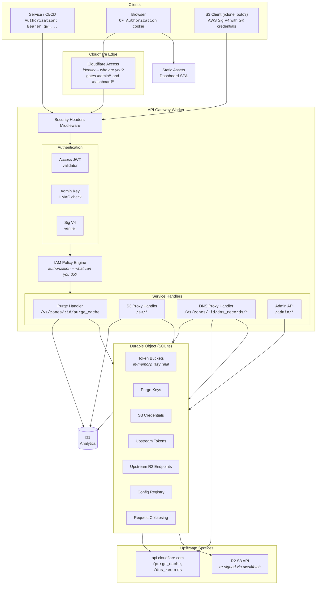

# Gatekeeper Architecture

Gatekeeper is a Cloudflare Workers API gateway that sits in front of the Cloudflare purge API, DNS Records API, and R2 S3-compatible storage. It provides IAM-style access control, token-bucket rate limiting, request collapsing, and a full management dashboard -- all running on a single Worker with a single Durable Object.

---

## Table of Contents

- [System Overview](#system-overview)
- [Design Decisions](#design-decisions)
- [Bounded Contexts](#bounded-contexts)
- [Durable Object Design](#durable-object-design)
- [Rate Limiting](#rate-limiting)
- [Dashboard](#dashboard)
- [Observability](#observability)
- [Project Layout](#project-layout)
- [Dependencies](#dependencies)
- [Performance Considerations and Risks](#performance-considerations-and-risks)

---

## System Overview



Three client types hit the gateway:

1. **Services / CI/CD** -- authenticate with a `Bearer gw_...` API key. Used for programmatic cache purge.
2. **Browsers** -- authenticate via Cloudflare Access (`CF_Authorization` cookie). Used for the dashboard and admin API.
3. **S3 clients** (rclone, boto3, AWS CLI) -- authenticate with AWS Signature V4 using Gatekeeper-issued credentials. Used for the S3-compatible proxy to R2.

The Worker routes requests through security-header middleware, then into the authentication layer (Access JWT, admin key HMAC, or Sig V4 verification), then through the IAM policy engine, and finally to the appropriate service handler. Handlers communicate with the Durable Object for state (keys, credentials, rate limits, config) and with D1 for analytics logging. Upstream calls go to `api.cloudflare.com` (purge) or R2's S3-compatible API (storage).

Static assets for the dashboard SPA are served via Workers Static Assets with SPA fallback. API routes (`/v1/*`, `/admin/*`, `/health`, `/s3/*`) are handled by the Worker via `run_worker_first`. DNS proxy routes live under `/v1/zones/:zoneId/dns_records/*` alongside the purge endpoint.

---

## Design Decisions

### Identity vs Authorization -- Two Separate Concerns

Cloudflare Access handles **identity** (who are you?) via JWT validation. The IAM engine handles **authorization** (what can you do?) via policy documents attached to API keys or S3 credentials. These are deliberately decoupled:

- Machine clients authenticate via API key (purge) or AWS Sig V4 (S3) and skip Access entirely.
- Human users authenticate via Access. When RBAC is configured, their role (admin/operator/viewer) is derived from IdP group memberships fetched via the Cloudflare Access get-identity endpoint. When RBAC is not configured, all authenticated users receive the admin role (backward compatible).
- The `/admin/me` endpoint returns the current user's email, role, groups, auth method, and logout URL.
- This separation means the gateway does not depend on Access for machine-to-machine traffic -- only for the dashboard and admin routes.

### Single Durable Object as Aggregate Root

One DO instance (`Gatekeeper`) holds all mutable state for the entire gateway: purge API keys, S3 credentials, upstream CF API tokens, upstream R2 endpoints, rate-limit buckets, config registry, and request collapsing. This is a deliberate simplification.

The Durable Object soft limit is approximately 1,000 RPS. This is well above the Cloudflare Enterprise purge ceiling, so a single DO is not a bottleneck. All state lives in DO SQLite, which is platform-encrypted at rest. Credential lookups use a 60-second in-memory cache to avoid repeated SQLite reads on the hot auth path.

### In-Memory-Only Token Buckets

Rate-limit token buckets are not persisted to SQLite. They exist only in DO memory. If the DO evicts from the runtime, buckets reset to full capacity. This is an intentional trade-off: the upstream API (Cloudflare, R2) is the real rate enforcer. The gateway's buckets are a courtesy that avoids wasting upstream quota on requests that will be rejected anyway.

### Config Registry with Env Var Fallback

All tunable gateway settings (rate limits, cache TTLs, retention period) use a three-tier resolution order: SQLite-backed registry override (highest priority), then environment variable fallback (e.g. `BULK_RATE`, `SINGLE_RATE`), then hardcoded default. Registry changes take effect immediately without redeployment. The DO rebuilds its token buckets whenever a rate-limit config value changes.

### Upstream Credentials as Runtime State

Upstream Cloudflare API tokens and R2 endpoint credentials are stored in the DO, not as Worker secrets. This allows managing multiple upstream tokens with different zone/bucket scopes, rotating credentials without redeploying, and auditing who registered what. Token values are write-only -- they cannot be retrieved after registration.

---

## Bounded Contexts

The system is divided into ten bounded contexts, each with a clear responsibility:

### 1. IAM (Purge Keys)

**Files:** `src/iam.ts`, `src/policy-engine.ts`, `src/policy-types.ts`, `src/routes/admin-keys.ts`

Manages purge API keys with policy documents modeled after AWS IAM. Each key has a policy with statements containing effects (allow/deny), actions (`purge:url`, `purge:host`, `purge:tag`, `purge:prefix`, `purge:everything`), resources (`zone:<id>`, `zone:*`, `*`), and optional conditions. Evaluation follows standard IAM precedence: explicit deny wins, then explicit allow, then implicit deny.

CRUD operations: create, list, get, revoke, delete, bulk revoke, bulk delete.

### 2. S3 IAM (S3 Credentials)

**Files:** `src/s3/iam.ts`, `src/s3/types.ts`, `src/s3/operations.ts`, `src/routes/admin-s3.ts`

Manages S3-compatible credentials (access key ID + secret access key). Each credential has a policy document with S3-specific actions (66 operations covering `s3:GetObject`, `s3:PutObject`, `s3:DeleteObject`, `s3:ListBucket`, etc.) and resources (`bucket:<name>`, `object:<bucket>/*`, `*`). Authentication uses AWS Signature V4 verification via `crypto.subtle`.

CRUD operations: create, list, get, revoke, delete, bulk revoke, bulk delete.

### 3. Purge

**Files:** `src/routes/purge.ts`, `src/durable-object.ts` (purge methods)

The core cache purge handler at `POST /v1/zones/:zoneId/purge_cache`. Accepts the same body format as the Cloudflare API (`files`, `hosts`, `tags`, `prefixes`, `purge_everything`). Authenticates via Bearer token, authorizes via the IAM policy engine, rate-limits via token buckets, collapses duplicate requests, and forwards to the upstream Cloudflare API.

### 4. S3 Proxy

**Files:** `src/s3/routes.ts`, `src/s3/sig-v4-verify.ts`, `src/s3/sig-v4-sign.ts`

An S3-compatible proxy at `/s3/*`. Receives requests signed with AWS Sig V4 (header or presigned URL), verifies the signature against Gatekeeper-issued credentials, authorizes via S3 IAM policies, resolves the matching upstream R2 endpoint, re-signs the request using `aws4fetch`, and forwards to R2's S3-compatible API.

### 5. Config

**Files:** `src/config-registry.ts`, `src/routes/admin-config.ts`

The runtime config registry. Stores key-value overrides in DO SQLite with a three-tier resolution order: registry override (highest priority), then env var fallback, then hardcoded default. Ten config keys control rate limits (`bulk_rate`, `bulk_bucket_size`, `single_rate`, `single_bucket_size`, `bulk_max_ops`, `single_max_ops`), S3 rate limits (`s3_rps`, `s3_burst`), cache TTL (`key_cache_ttl_ms`), and analytics retention (`retention_days`). Writing a config value triggers an immediate token bucket rebuild.

### 6. Analytics (Purge)

**Files:** `src/analytics.ts`, `src/routes/admin-analytics.ts`

Logs purge events to a D1 database. Each event records the zone, purge type, status, duration, whether the request was collapsed, the key ID, and the flight ID. Provides query endpoints for event listing (with filters) and summary aggregation. A daily cron at 03:00 UTC deletes events older than the configured retention period.

### 7. S3 Analytics

**Files:** `src/s3/analytics.ts`, `src/routes/admin-s3.ts` (analytics endpoints)

Logs S3 proxy events to D1. Each event records the operation, bucket, object key, status, duration, and credential ID. Shares the same retention cron as purge analytics.

### 8. Upstream Tokens

**Files:** `src/upstream-tokens.ts`, `src/routes/admin-upstream-tokens.ts`

Registry of upstream Cloudflare API tokens. Each token has a name, the token value (write-only), and a zone scope (list of zone IDs or `*` for all zones). When a purge request arrives, the gateway resolves the best matching token: exact zone match preferred over wildcard.

CRUD operations: create, list, get, delete, bulk delete.

### 9. Upstream R2

**Files:** `src/s3/upstream-r2.ts`, `src/routes/admin-upstream-r2.ts`

Registry of upstream R2 endpoint credentials. Each endpoint has a name, access key, secret key (write-only), the R2 endpoint URL, and a bucket scope. When an S3 request arrives, the gateway resolves the best matching endpoint: exact bucket match preferred over wildcard.

CRUD operations: create, list, get, delete, bulk delete.

### 10. DNS Proxy

**Files:** `src/dns/routes.ts`, `src/dns/operations.ts`, `src/dns/analytics.ts`, `src/routes/admin-dns-analytics.ts`

Proxies Cloudflare DNS Records API operations (`/v1/zones/:zoneId/dns_records/*`). Uses the same API keys and upstream tokens as purge. Eight IAM actions (`dns:create`, `dns:read`, `dns:update`, `dns:delete`, `dns:batch`, `dns:export`, `dns:import`, `dns:*`) with seven condition fields (`dns.name`, `dns.type`, `dns:content`, `dns.proxied`, `dns.ttl`, `dns.comment`, `dns.tags`). DELETE operations perform a pre-flight GET to resolve record metadata for policy evaluation. Batch operations decompose into individual authorization contexts per sub-operation. DNS events are logged to D1 (`dns_events` table) and share the same retention cron as purge and S3.

---

## Durable Object Design

### Single DO Instance

The `Gatekeeper` class extends `DurableObject<Env>` and is the sole Durable Object class in the system. A single named instance (obtained via `env.GATEKEEPER.get(id)`) serves as the aggregate root for all gateway state.

Initialization happens inside `ctx.blockConcurrencyWhile()`:

1. `ConfigManager` initializes its SQLite table and loads the resolved config.
2. Token buckets are created from the config (`bulkBucket`, `singleBucket`, `s3Bucket`).
3. `IamManager`, `S3CredentialManager`, `UpstreamTokenManager`, and `UpstreamR2Manager` each initialize their SQLite tables.

All managers receive a cache TTL from the config (default 60 seconds) for in-memory credential caching.

### SQLite Tables

Each manager owns one SQLite table inside the DO:

| Manager                | Table             | Key columns                                                                    |
| ---------------------- | ----------------- | ------------------------------------------------------------------------------ |
| `IamManager`           | `api_keys`        | `id`, `name`, `zone_id`, `policy`, `revoked`, `created_by`                     |
| `S3CredentialManager`  | `s3_credentials`  | `access_key_id`, `secret_access_key`, `policy`, `revoked`                      |
| `UpstreamTokenManager` | `upstream_tokens` | `id`, `name`, `token`, `zone_ids`                                              |
| `UpstreamR2Manager`    | `upstream_r2`     | `id`, `name`, `access_key_id`, `secret_access_key`, `endpoint`, `bucket_names` |
| `ConfigManager`        | `config`          | `key`, `value`, `updated_by`, `updated_at`                                     |

Tables are created via `CREATE TABLE IF NOT EXISTS` during initialization -- no external migration step needed.

### RPC Methods

The Worker communicates with the DO via RPC (Durable Object method calls). The `Gatekeeper` class exposes methods grouped by context:

**Purge:** `purge()`, `consume()`, `getRateLimitInfo()`, `drainBucket()`

**Purge IAM:** `createKey()`, `listKeys()`, `getKey()`, `revokeKey()`, `deleteKey()`, `bulkRevokeKeys()`, `bulkDeleteKeys()`, `bulkInspectKeys()`, `authorizeFromBody()`

**S3 IAM:** `createS3Credential()`, `listS3Credentials()`, `getS3Credential()`, `revokeS3Credential()`, `deleteS3Credential()`, `bulkRevokeS3Credentials()`, `bulkDeleteS3Credentials()`, `bulkInspectS3Credentials()`, `getS3Secret()`, `authorizeS3()`, `consumeS3RateLimit()`

**Upstream Tokens:** `createUpstreamToken()`, `listUpstreamTokens()`, `getUpstreamToken()`, `deleteUpstreamToken()`, `bulkDeleteUpstreamTokens()`, `bulkInspectUpstreamTokens()`, `resolveUpstreamToken()`

**Upstream R2:** `createUpstreamR2()`, `listUpstreamR2()`, `getUpstreamR2()`, `deleteUpstreamR2()`, `bulkDeleteUpstreamR2()`, `bulkInspectUpstreamR2()`, `resolveR2ForBucket()`, `resolveR2ForListBuckets()`

**Config:** `getConfig()`, `setConfig()`, `resetConfigKey()`, `listConfigOverrides()`

### In-Memory State

Beyond SQLite, the DO holds transient in-memory state:

- **Token buckets** (`bulkBucket`, `singleBucket`, `s3Bucket`) -- lazy-refill, no I/O.
- **Per-key buckets** (`keyBuckets: Map`) -- lazily created when a key with custom rate limits is first used. Cleared when account-level rate-limit config changes.
- **Request collapser** (`RequestCollapser<PurgeResult>`) -- deduplicates identical purge requests within a 50ms grace window.
- **Credential caches** -- each manager caches lookups in memory with a configurable TTL (default 60s).

---

## Rate Limiting

### Dual Token Bucket

Two account-level buckets per gateway instance, using lazy refill (tokens accrue on read, not on a timer):

| Bucket         | Rate (tokens/sec) | Capacity | Applies to                                                            |
| -------------- | ----------------- | -------- | --------------------------------------------------------------------- |
| `purge-single` | 3,000             | 6,000    | `files` (1 token per URL)                                             |
| `purge-bulk`   | 50                | 500      | `hosts`, `tags`, `prefixes`, `purge_everything` (1 token per request) |

These defaults target the Cloudflare Enterprise purge tier and are configurable at runtime via the config registry.

A third bucket (`s3Bucket`) rate-limits S3 proxy requests at the account level, also configurable via `s3_rps` and `s3_burst`.

### Decision Flow

1. If the gateway's bucket says no: return 429 without touching Cloudflare.
2. If the gateway allows but the upstream returns 429: drain the local bucket to zero and forward the 429 to the client.

This ensures the gateway never burns upstream quota on requests it knows will fail, while also synchronizing with the upstream's actual state.

### Per-Key Rate Limits

Optional. Set `rate_limit` (with `bulk_rate`, `bulk_bucket`, `single_rate`, `single_bucket`) when creating a key. Per-key limits are checked before the account-level bucket. Per-key 429 responses use distinct header names (`purge-bulk-key` / `purge-single-key`) so clients can distinguish key-level throttling from account-level throttling.

Per-key buckets are lazily created on first use and stored in the `keyBuckets` map. They are cleared when account-level rate-limit config changes.

### Request Collapsing

Identical purge requests (same zone + same body) within a grace window share one upstream call and one token deduction:

1. **Isolate-level** -- `Map<string, Promise<PurgeResult>>` in the Worker isolate. Identical requests in the same isolate share the leader's result.
2. **DO-level** -- same mechanism inside the Durable Object, before the upstream fetch.

Both use a 50ms grace window. Collapsed requests are tagged in analytics as `collapsed: "isolate"` or `collapsed: "do"`.

### Rate Limit Headers

Responses include standard rate-limit headers:

- `Ratelimit: "<bucket-name>";r=<remaining>;t=<retry-after-sec>`
- `Ratelimit-Policy: "<bucket-name>";q=<capacity>;w=<window-sec>`
- `Retry-After: <seconds>` (on 429 responses)

---

## Dashboard

### Tech Stack

- **Astro 5** -- static output mode (no SSR, no adapter). Pre-renders to HTML/JS/CSS.
- **React 19** -- client-side islands for interactive components.
- **Tailwind CSS 4** -- utility-first styling.
- **shadcn/ui** -- component primitives (`ui/` directory).
- **Recharts** -- charting library for the overview dashboard.

The dashboard is a separate workspace (`dashboard/` with its own `package.json`). Build pipeline: `cd dashboard && npm run build` outputs to `dashboard/dist/`, which `wrangler deploy` picks up via the assets config.

### Serving Model

Workers Static Assets with `run_worker_first`:

```jsonc
{
	"assets": {
		"directory": "./dashboard/dist/",
		"binding": "ASSETS",
		"not_found_handling": "single-page-application",
		"run_worker_first": ["/v1/*", "/admin/*", "/health", "/s3", "/s3/*"],
	},
}
```

API routes hit the Hono Worker. Everything else serves the SPA with client-side routing.

### Design System -- Lovelace Palette

Deep charcoal base with warm pastel-neon accents. Inspired by the Lovelace color scheme from iTerm2.

| Token                | Hex       | Usage                                   |
| -------------------- | --------- | --------------------------------------- |
| `--background`       | `#1d1f28` | Page background                         |
| `--surface`          | `#282a36` | Card/panel backgrounds                  |
| `--surface-elevated` | `#414457` | Elevated surfaces, hover states         |
| `--border`           | `#414457` | Borders, dividers                       |
| `--foreground`       | `#fcfcfc` | Primary text                            |
| `--muted`            | `#bdbdc1` | Secondary text, labels                  |
| `--primary`          | `#c574dd` | Primary accent (magenta-purple)         |
| `--success`          | `#5adecd` | Green -- allowed, cached, healthy       |
| `--danger`           | `#f37e96` | Soft red-pink -- blocked, errors        |
| `--warning`          | `#f1a171` | Warm peach -- warnings, rate-limited    |
| `--info`             | `#8796f4` | Periwinkle blue -- informational, links |
| `--cyan`             | `#79e6f3` | Cyan -- secondary data accent           |

Chart color slots: `#c574dd`, `#5adecd`, `#f37e96`, `#f1a171`, `#8796f4`.

**Typography:** Space Grotesk (body text), JetBrains Mono (data, code, stat values, table cells).

**Layout:** Fixed sidebar (w-60) with 8 nav links in 5 sections, plus a fixed header (h-14) showing page title and health status. Main content area is scrollable with a scroll-to-top FAB.

**Visual effects:** Subtle glow on primary accent elements, fade-in-up entrance animations on stat cards, count-up animation for stat numbers, custom scrollbar (thin, purple thumb), button micro-interactions (`active:scale-[0.97]`).

### Pages

| Route                        | Content                                                                                  |
| ---------------------------- | ---------------------------------------------------------------------------------------- |
| `/dashboard`                 | Summary stats, traffic timeline (area chart), purge type donut, top zones, recent events |
| `/dashboard/keys`            | Purge key CRUD with filter tabs, search, sortable columns, pagination, policy builder    |
| `/dashboard/s3-credentials`  | S3 credential CRUD with policy preview (ALLOW/DENY badges), AWS IAM import               |
| `/dashboard/upstream-tokens` | Upstream CF API token registry                                                           |
| `/dashboard/upstream-r2`     | Upstream R2 endpoint registry                                                            |
| `/dashboard/analytics`       | Unified event log (purge + S3) with filters, expandable detail rows, JSON export         |
| `/dashboard/purge`           | Manual purge form with live rate-limit status                                            |
| `/dashboard/settings`        | Config registry editor with inline edit, reset-to-default                                |

### Component Inventory

| Component           | Purpose                                                       |
| ------------------- | ------------------------------------------------------------- |
| `DashboardLayout`   | Astro layout: sidebar, header, content slot                   |
| `OverviewDashboard` | Stat cards (count-up), traffic chart, purge type donut        |
| `KeysPage`          | Purge key CRUD with policy builder                            |
| `S3CredentialsPage` | S3 credential CRUD with S3 policy builder                     |
| `AnalyticsPage`     | Unified event log with expandable details                     |
| `PolicyBuilder`     | Visual purge policy editor with condition tree                |
| `S3PolicyBuilder`   | Visual S3 policy editor (19 action toggles, AWS IAM import)   |
| `ConditionEditor`   | Recursive condition tree: leaf/AND/OR/NOT groups, pill inputs |
| `TablePagination`   | Shared pagination bar with page size selector                 |
| `usePagination`     | Client-side pagination hook [10, 25, 50, 100]                 |
| `PurgePage`         | Manual purge form with type selector and zone picker          |
| `SettingsPage`      | Config registry editor with inline edit and reset             |

---

## Observability

### Structured JSON Logging

One JSON object per request via `console.log`. Cloudflare's built-in observability pipeline picks it up (Workers Logs, Logpush, etc.).

Example log entry:

```json
{
	"route": "purge",
	"method": "POST",
	"zoneId": "abc123...",
	"purgeType": "bulk",
	"cost": 1,
	"keyId": "gw_a1b2c3d4...",
	"collapsed": false,
	"rateLimitAllowed": true,
	"rateLimitRemaining": 499,
	"upstreamStatus": 200,
	"status": 200,
	"durationMs": 102
}
```

Fields include route, HTTP method, zone/bucket context, purge type or S3 operation, token cost, key/credential ID, collapse status, rate-limit state, upstream status, final response status, and latency.

### Breadcrumb Logging

Every significant decision point emits a structured breadcrumb log. These are designed to let operators debug auth failures, IdP misconfigurations, upstream resolution, and request flow without reading source code.

Format:

```json
{ "breadcrumb": "iam-authorize-ok", "keyId": "gw_abc...", "zoneId": "abc123...", "action": "purge:host" }
```

The `breadcrumb` field is always a kebab-case string prefixed with the module area. Context fields vary per breadcrumb.

Breadcrumbs are organized by subsystem:

| Module             | Breadcrumb Prefix               | Decision Points                                                             |
| ------------------ | ------------------------------- | --------------------------------------------------------------------------- |
| Durable Object     | `do-*`                          | Init, bucket rebuild, per-key/account rate limiting, upstream fetch, 429    |
| IAM (purge keys)   | `iam-*`                         | Not found, revoked, expired, zone mismatch, policy denied, authorized       |
| Credential Manager | `credential-*`                  | Not found, revoked, expired, policy denied, authorized, cache miss, corrupt |
| Auth (CF Access)   | `access-*`                      | JWT source, validation, groups extraction, RBAC role resolution             |
| Auth (admin)       | `auth-admin-*`                  | Method selection, RBAC enforcement, role check                              |
| Request Collapsing | `collapse-*`                    | Stale eviction, follower joined, leader failed                              |
| Upstream Tokens    | `upstream-token-*`              | Cache hit, exact match, wildcard match, not found                           |
| Upstream R2        | `upstream-r2-*`                 | Cache hit, exact match, wildcard match, not found, list-buckets             |
| Config Registry    | `config-*`                      | Resolved config with per-key source (registry/env/default)                  |
| Config Cache       | `config-cache-*`                | Isolate-level cache miss                                                    |
| Admin Routes       | `admin-*`, `validate-*`         | Resource not found (404), credential validation probes                      |
| Admin Schemas      | `parse-*`                       | Query/path parameter validation failures                                    |
| Analytics          | `analytics-*`, `s3-analytics-*` | ensureTables failures, not-configured                                       |
| Policy Engine      | `policy-*`                      | Condition depth exceeded, invalid regex                                     |

Pure crypto modules (`sig-v4-verify.ts`, `sig-v4-sign.ts`) do not emit breadcrumbs -- the calling layer logs all outcomes.

### D1 Analytics

Purge and S3 events are persisted to a D1 database (`gatekeeper-analytics`) for queryable history. The admin API exposes event listing (with filters for status, type, zone, time range) and summary aggregation (counts, status breakdowns, average latency).

A daily cron trigger at 03:00 UTC deletes events older than the configured `retention_days` (default 30).

### Wrangler Observability

The `observability.enabled: true` flag in `wrangler.jsonc` enables Cloudflare's built-in request tracing and log collection.

---

## Project Layout

```
wrangler.jsonc                       Worker config: DO, D1, Static Assets, cron
openapi.json                         OpenAPI 3.1 spec (all endpoints)
src/
  index.ts                           Entrypoint: Hono app, security headers middleware, cron
  durable-object.ts                  Gatekeeper DO: all managers, RPC methods, bucket rebuild
  config-registry.ts                 ConfigManager: SQLite table, 3-tier resolution, GatewayConfig
  upstream-tokens.ts                 UpstreamTokenManager: CF API token registry + zone resolution
  routes/
    purge.ts                         POST /v1/zones/:zoneId/purge_cache
    admin.ts                         Admin sub-app (mounts all admin route modules)
    admin-keys.ts                    Key CRUD (validates rate limits against GatewayConfig)
    admin-config.ts                  GET/PUT /admin/config, DELETE /admin/config/:key
    admin-upstream-tokens.ts         Upstream CF API token CRUD
    admin-upstream-r2.ts             Upstream R2 endpoint CRUD
    admin-analytics.ts               Purge analytics queries
    admin-s3.ts                      S3 credential CRUD + S3 analytics queries
  types.ts                           Shared types (HonoEnv, RateLimitConfig, ApiKey, etc.)
  policy-types.ts                    PolicyDocument, Statement, Condition, RequestContext
  request-fields.ts                  extractRequestFields() -- client_ip, country, ASN, time
  policy-engine.ts                   evaluatePolicy(), validatePolicy()
  auth-access.ts                     Cloudflare Access JWT validation + get-identity groups
  auth-admin.ts                      Admin auth middleware: Access JWT or X-Admin-Key, RBAC
  iam.ts                             IamManager: createKey, authorize, authorizeFromBody
  token-bucket.ts                    Token bucket (lazy refill, no I/O)
  analytics.ts                       D1 analytics for purge (events, summary, retention)
  crypto.ts                          queryAll helper, HMAC utils
  do-stub.ts                         getStub() -- named DO ID helper
  env.d.ts                           Env type extensions (ADMIN_KEY, CF_ACCESS_*)
  constants.ts                       Shared constants (API base, TTLs, limits, headers)
  s3/
    upstream-r2.ts                   UpstreamR2Manager: R2 credential registry + bucket resolution
    types.ts                         S3Credential, S3Operation, SigV4Components (66 operations)
    operations.ts                    detectOperation (66 ops), parsePath, buildConditionFields
    iam.ts                           S3CredentialManager (CRUD, 60s cache, auth)
    sig-v4-verify.ts                 verifySigV4 (header), verifySigV4Presigned (query)
    sig-v4-sign.ts                   forwardToR2 via aws4fetch (multi-client cache, param stripping)
    routes.ts                        Hono sub-app: auth, batch delete, analytics logging
    xml.ts                           S3 XML error responses, DeleteObjects XML parsing
    analytics.ts                     D1 analytics for S3 (logS3Event, queryS3Events, queryS3Summary)
cli/
  index.ts                           Entry point (citty, 9 subcommands)
  smoke-test.ts                      E2E smoke test orchestrator
  smoke/                             Modularized smoke test modules (9 files)
  client.ts                          HTTP client
  ui.ts                              Colors, spinners, tables
  commands/
    health.ts                        gk health
    keys.ts                          gk keys {create,list,get,revoke,bulk-revoke,bulk-delete}
    purge.ts                         gk purge {hosts,tags,prefixes,urls,everything}
    analytics.ts                     gk analytics {events,summary}
    s3-credentials.ts                gk s3-credentials {create,list,get,revoke,bulk-revoke,bulk-delete}
    s3-analytics.ts                  gk s3-analytics {events,summary}
    upstream-tokens.ts               gk upstream-tokens {create,list,get,delete,bulk-delete}
    upstream-r2.ts                   gk upstream-r2 {create,list,get,delete,bulk-delete}
    config.ts                        gk config {get,set,reset}
test/                                31 test files (664 tests, with 1 CLI test in cli/)
  helpers.ts                         Test factories, upstream token registration, mock helpers
  s3-helpers.ts                      R2 upstream registration, test constants
  policy-helpers.ts                  Shared policy test helpers
dashboard/
  public/
    favicon.svg                      Lightning bolt on purple
    _headers                         Security headers for static assets (CSP, X-Frame-Options, etc.)
  src/
    layouts/DashboardLayout.astro    Sidebar nav, header, scroll-to-top
    lib/api.ts                       API client (all admin endpoints)
    lib/aws-policy-converter.ts      AWS IAM to Gatekeeper policy conversion
    lib/typography.ts                Shared typography constants
    components/
      OverviewDashboard.tsx          Stats, charts, recent events
      KeysPage.tsx                   Purge key CRUD + policy builder
      S3CredentialsPage.tsx          S3 credential CRUD + S3 policy builder
      UpstreamTokensPage.tsx         Upstream CF API token management
      UpstreamR2Page.tsx             Upstream R2 endpoint management
      SettingsPage.tsx               Config registry editor
      AnalyticsPage.tsx              Event log + summary
      PurgePage.tsx                  Manual purge form
      ConditionEditor.tsx            Shared condition tree
      PolicyBuilder.tsx              Visual purge policy editor
      S3PolicyBuilder.tsx            Visual S3 policy editor
      TablePagination.tsx            Shared pagination bar
      ui/                            shadcn/ui primitives
    hooks/
      use-pagination.ts              Client-side pagination hook
  dist/                              Built output (served via Static Assets)
```

---

## Dependencies

| Package                                        | Role                                           |
| ---------------------------------------------- | ---------------------------------------------- |
| `hono`                                         | HTTP routing (Worker runtime dependency)       |
| `zod`                                          | Request validation (Worker runtime dependency) |
| `aws4fetch`                                    | AWS Sig V4 re-signing for outbound R2 requests |
| `wrangler`                                     | Dev server, build, deploy                      |
| `vitest` + `@cloudflare/vitest-pool-workers`   | Tests running in the Workers runtime           |
| `citty`                                        | CLI framework                                  |
| `tsx`                                          | Runs CLI in development without a build step   |
| `astro` + `react` + `tailwindcss` + `recharts` | Dashboard SPA                                  |

The Worker itself has only three runtime dependencies: `hono` (routing), `zod` (request validation), and `aws4fetch` (S3 re-signing). Everything else is a dev/build/test dependency.

---

## Performance Considerations and Risks

| Risk                                        | Impact                       | Mitigation                                                                                                      |
| ------------------------------------------- | ---------------------------- | --------------------------------------------------------------------------------------------------------------- |
| Regex ReDoS in conditions                   | DO CPU spike, 1102 errors    | Max 256 chars, reject nested quantifiers, validate at credential creation.                                      |
| Policy evaluation overhead                  | Latency on every request     | Cache compiled conditions per key. Short-circuit: no conditions = instant allow.                                |
| S3 Sig V4 verification overhead             | +2-5ms per S3 request        | HMAC-SHA256 via `crypto.subtle` is fast. Credential cache (60s TTL) avoids DO round-trips.                      |
| S3 credential cache staleness               | Revoked cred works up to 60s | Acceptable trade-off for performance. Cache TTL is configurable via `key_cache_ttl_ms`.                         |
| R2 admin token exposure                     | Full R2 access if leaked     | Stored in DO SQLite (platform-encrypted at rest), never returned via API. Only used server-side for re-signing. |
| Dashboard bundle size                       | Slow first load              | Code split per route, lazy-load charts, precompress with brotli.                                                |
| Access JWT validation latency               | +10-50ms per admin request   | Cache JWKS in-memory (1h TTL), `crypto.subtle.verify` is fast.                                                  |
| Policy schema too rigid for future services | Refactoring later            | Version field in policy doc. Engine dispatches on version.                                                      |
| Static assets + Worker in same deploy       | Build complexity             | Separate build scripts, CI runs dashboard build then wrangler deploy.                                           |

### Key Constants

Reference values from `src/constants.ts`:

| Constant                        | Value                                  | Purpose                                     |
| ------------------------------- | -------------------------------------- | ------------------------------------------- |
| `CF_API_BASE`                   | `https://api.cloudflare.com/client/v4` | Upstream Cloudflare API base URL            |
| `DEFAULT_CACHE_TTL_MS`          | `60,000`                               | In-memory cache TTL for credential lookups  |
| `DEFAULT_RETRY_AFTER_SEC`       | `5`                                    | Fallback Retry-After when upstream omits it |
| `JWT_CLOCK_SKEW_SEC`            | `60`                                   | Clock-skew tolerance for JWT and Sig V4     |
| `MAX_LOG_VALUE_LENGTH`          | `4,096`                                | Max chars for logged response bodies        |
| `MAX_DELETE_OBJECTS_BODY_BYTES` | `1,048,576`                            | Max body size for S3 DeleteObjects (1 MiB)  |
| `MAX_PRESIGNED_EXPIRY_SEC`      | `604,800`                              | Max presigned URL lifetime (7 days)         |
| `DEFAULT_ANALYTICS_LIMIT`       | `100`                                  | Default page size for analytics queries     |
| `MAX_ANALYTICS_LIMIT`           | `1,000`                                | Maximum page size for analytics queries     |

### Cloudflare Worker Bindings

From `wrangler.jsonc`:

| Binding                | Type              | Purpose                                        |
| ---------------------- | ----------------- | ---------------------------------------------- |
| `GATEKEEPER`           | Durable Object    | Single DO instance for all gateway state       |
| `ANALYTICS_DB`         | D1 Database       | Purge and S3 analytics event storage           |
| `ASSETS`               | Static Assets     | Dashboard SPA files                            |
| `ADMIN_KEY`            | Secret            | Admin API authentication                       |
| `CF_ACCESS_TEAM_NAME`  | Secret (optional) | Cloudflare Access team name for JWT validation |
| `CF_ACCESS_AUD`        | Secret (optional) | Cloudflare Access audience tag                 |
| `RBAC_ADMIN_GROUPS`    | Secret (optional) | Comma-separated IdP groups mapped to admin     |
| `RBAC_OPERATOR_GROUPS` | Secret (optional) | Comma-separated IdP groups mapped to operator  |
| `RBAC_VIEWER_GROUPS`   | Secret (optional) | Comma-separated IdP groups mapped to viewer    |

Cron trigger: `0 3 * * *` (daily at 03:00 UTC) for analytics retention cleanup.
