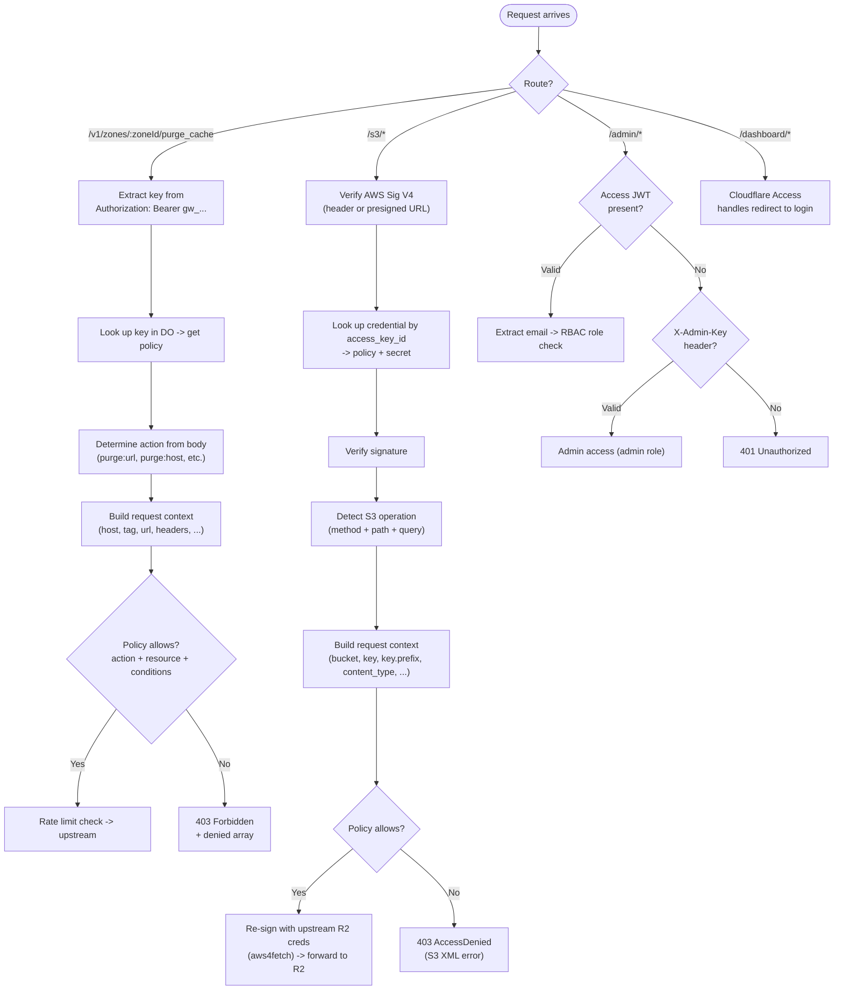

# Security

This document describes the authentication, authorization, and security architecture of Gatekeeper.

---

## Table of Contents

- [Authentication Tiers](#authentication-tiers)
- [Cloudflare Access Integration](#cloudflare-access-integration)
- [IAM Policy Engine](#iam-policy-engine)
  - [Concepts](#concepts)
  - [Policy Document Schema](#policy-document-schema)
  - [Actions](#actions)
  - [Resources](#resources)
  - [Condition Operators](#condition-operators)
  - [Condition Fields](#condition-fields)
  - [Compound Conditions](#compound-conditions)
  - [Authorization Flow](#authorization-flow)
  - [Policy Examples](#policy-examples)
  - [Regex Safety](#regex-safety)
- [RBAC Roles](#rbac-roles)
- [Security Headers](#security-headers)
- [Risks and Mitigations](#risks-and-mitigations)

---

## Authentication Tiers

Gatekeeper uses four authentication tiers, each suited to a different principal type and route set.

| Tier                  | Principal          | Mechanism                                                    | Routes                     |
| --------------------- | ------------------ | ------------------------------------------------------------ | -------------------------- |
| API key (`gw_*`)      | Services, CI/CD    | `Authorization: Bearer gw_...`                               | `/v1/*` (purge + DNS)      |
| S3 credential (`GK*`) | S3 clients         | AWS Sig V4 (header or presigned URL)                         | `/s3/*`                    |
| Access JWT            | Humans (dashboard) | `Cf-Access-Jwt-Assertion` header / `CF_Authorization` cookie | `/admin/*`, `/dashboard/*` |
| Admin key             | CLI, automation    | `X-Admin-Key` header                                         | `/admin/*`                 |

**Key details:**

- **API keys** are prefixed `gw_*`. The raw key is never stored -- only an HMAC-SHA256 hash (`key_hash`) is persisted in the Durable Object's SQLite database.
- **S3 credentials** use standard AWS Signature Version 4 for authentication. The signing algorithm is `AWS4-HMAC-SHA256`. Credentials are prefixed `GK*`.
- **Access JWTs** are validated using `crypto.subtle` (RS256) with no external dependencies. See [Cloudflare Access Integration](#cloudflare-access-integration) below.
- **Admin key** comparison uses HMAC-SHA256 combined with `crypto.subtle.timingSafeEqual` to prevent timing side-channel attacks.

---

## Cloudflare Access Integration

Cloudflare Access gates `/admin/*` and `/dashboard/*` as a self-hosted application. When a browser hits these paths, Access redirects to the configured identity provider (Google, GitHub, SAML, OTP, etc.). After login, Access injects:

- `Cf-Access-Jwt-Assertion` header -- signed JWT on every proxied request
- `CF_Authorization` cookie -- same JWT, for browser-initiated requests

### JWT Validation

The Worker validates whichever token source is present. The entire validation flow is approximately 80 lines of code with zero external dependencies -- `crypto.subtle` handles RSA-PKCS1-v1_5 natively.

Validation steps:

1. Extract JWT from the `Cf-Access-Jwt-Assertion` header, falling back to the `CF_Authorization` cookie.
2. Parse the three-part JWT (header, payload, signature).
3. Verify the algorithm is `RS256`.
4. Fetch the JWKS from `https://<team>.cloudflareaccess.com/cdn-cgi/access/certs`. Keys are cached in-memory with a 1-hour TTL. On a `kid` miss, the cache is force-refreshed once to handle key rotation.
5. Import the matching JWK via `crypto.subtle.importKey` and verify the signature via `crypto.subtle.verify`.
6. Check `exp` (expiry) and `iat` (issued-at with 60-second clock-skew tolerance).
7. Check `iss` matches `https://<team>.cloudflareaccess.com`.
8. Check `aud` contains the configured Application Audience tag.

JWT claims used: `sub`, `email`, `iss`, `aud`, `exp`, `iat`, `type` (`app` for users, `service-token` for service tokens).

**Group memberships for RBAC** are not included in the Access JWT for self-hosted apps. Instead, after JWT validation, the Worker calls the Cloudflare Access get-identity endpoint (`https://<team>.cloudflareaccess.com/cdn-cgi/access/get-identity`) using the validated JWT as a cookie. Groups are extracted from three possible locations in the response (checked in order): `custom.groups` (custom OIDC claims, e.g. Authentik), `oidc_fields.groups` (OIDC passthrough), and `groups` (SCIM-synced groups). Both string arrays and `{id, name}` object arrays are handled.

### Access Application Setup

1. Cloudflare One -> Access -> Applications -> Add -> Self-hosted
2. Domain: your gateway domain
3. Paths: `/admin/*`, `/dashboard/*` (leave `/v1/*` and `/health` unprotected)
4. Policy: Allow -> emails/groups you control
5. Copy the **Application Audience (AUD) tag** and set it as `CF_ACCESS_AUD`
6. Set `CF_ACCESS_TEAM_NAME` to your Cloudflare Zero Trust team name

### Design Decisions

- **No `jose` library.** `crypto.subtle` does RSA verification natively. ~80 lines vs ~50KB dependency.
- **No `workers-oauth-provider`.** Gatekeeper is a resource server that validates Access JWTs for identity and uses its own IAM for authorization. It is not an OAuth provider.
- **Self-hosted Access app, not SaaS.** SaaS apps are for when Access acts as an OIDC IdP to external services. Self-hosted is for protecting your own origin.

---

## IAM Policy Engine

Each API key and S3 credential has a policy document -- a JSON structure with statements, modeled after AWS IAM. The policy engine evaluates these against a request context at authorization time.

### Concepts

| Concept       | AWS IAM Equivalent        | Gatekeeper                                                             |
| ------------- | ------------------------- | ---------------------------------------------------------------------- |
| **Principal** | IAM user / role           | API key holder (key ID) or Access-authenticated user (email)           |
| **Action**    | `s3:GetObject`            | `purge:url`, `purge:host`, `purge:tag`, `s3:GetObject`, `s3:PutObject` |
| **Resource**  | `arn:aws:s3:::bucket/*`   | `zone:<zone-id>`, `bucket:<name>`, `object:<bucket>/<key>`             |
| **Condition** | `StringLike`, `IpAddress` | Expression engine: `eq`, `contains`, `starts_with`, `matches`, etc.    |
| **Effect**    | Allow / Deny              | Allow / Deny. Explicit deny overrides allow (standard IAM precedence). |
| **Policy**    | IAM policy document       | JSON document with statements, attached to API keys                    |

### Policy Document Schema

```json
{
	"version": "2025-01-01",
	"statements": [
		{
			"effect": "allow",
			"actions": ["purge:host", "purge:tag"],
			"resources": ["zone:aaaa1111bbbb2222cccc3333dddd4444"],
			"conditions": [{ "field": "host", "operator": "ends_with", "value": ".example.com" }]
		}
	]
}
```

**TypeScript definitions** (from `src/policy-types.ts`):

```typescript
interface PolicyDocument {
	version: '2025-01-01';
	statements: Statement[];
}

interface Statement {
	effect: 'allow' | 'deny';
	actions: string[];
	resources: string[];
	conditions?: Condition[];
}

type Condition = LeafCondition | CompoundCondition;

interface LeafCondition {
	field: string;
	operator: LeafOperator;
	value: string | string[] | boolean;
}

type CompoundCondition = AnyCondition | AllCondition | NotCondition;
interface AnyCondition {
	any: Condition[];
} // OR
interface AllCondition {
	all: Condition[];
} // AND
interface NotCondition {
	not: Condition;
} // negation
```

A key can have one policy document. The policy has one or more statements. Evaluation follows standard IAM precedence:

1. If **any** deny statement matches -- **denied** (explicit deny always wins)
2. If **any** allow statement matches -- **allowed**
3. If nothing matches -- **denied** (implicit deny)

Within a single statement, **all** of the following must be true for it to match (AND):

1. The requested **action** matches one of the statement's actions
2. The targeted **resource** matches one of the statement's resources
3. **All** conditions evaluate to true against the request context

### Actions

Namespaced by service. Wildcard suffix supported (`purge:*` matches all purge actions).

#### Purge service (6 actions)

| Action             | Description                              |
| ------------------ | ---------------------------------------- |
| `purge:url`        | Purge by URL(s) via `files[]`            |
| `purge:host`       | Purge by hostname(s) via `hosts[]`       |
| `purge:tag`        | Purge by cache tag(s) via `tags[]`       |
| `purge:prefix`     | Purge by URL prefix(es) via `prefixes[]` |
| `purge:everything` | Purge everything in a zone               |
| `purge:*`          | All purge actions                        |

#### Admin service (6 actions)

| Action                 | Description         |
| ---------------------- | ------------------- |
| `admin:keys:create`    | Create API keys     |
| `admin:keys:list`      | List API keys       |
| `admin:keys:revoke`    | Revoke API keys     |
| `admin:keys:read`      | Read key details    |
| `admin:analytics:read` | Read analytics data |
| `admin:*`              | All admin actions   |

#### S3/R2 service (10+ actions covering 66 operations)

| Action                        | Description                                              |
| ----------------------------- | -------------------------------------------------------- |
| `s3:GetObject`                | Read objects (also covers HeadObject)                    |
| `s3:PutObject`                | Write objects (also covers CopyObject, multipart upload) |
| `s3:DeleteObject`             | Delete objects (single and batch)                        |
| `s3:ListBucket`               | List bucket contents (v1 and v2)                         |
| `s3:ListAllMyBuckets`         | List all buckets                                         |
| `s3:CreateBucket`             | Create bucket                                            |
| `s3:DeleteBucket`             | Delete bucket                                            |
| `s3:AbortMultipartUpload`     | Abort multipart upload                                   |
| `s3:ListMultipartUploadParts` | List parts of a multipart upload                         |
| `s3:*`                        | All S3 actions (66 operations mapped)                    |

#### DNS service (8 actions)

| Action       | Description                                                  |
| ------------ | ------------------------------------------------------------ |
| `dns:create` | Create a DNS record                                          |
| `dns:read`   | Get or list DNS records                                      |
| `dns:update` | Edit (PATCH) or overwrite (PUT) a DNS record                 |
| `dns:delete` | Delete a DNS record                                          |
| `dns:batch`  | Batch create/update/delete (each sub-operation also checked) |
| `dns:export` | Export zone file (BIND format)                               |
| `dns:import` | Import zone file (BIND format)                               |
| `dns:*`      | All DNS actions                                              |

### Resources

Typed identifiers with optional wildcards.

| Pattern                    | Matches                                 |
| -------------------------- | --------------------------------------- |
| `zone:<id>`                | Specific zone (purge service)           |
| `zone:*`                   | All zones                               |
| `bucket:<name>`            | Specific R2 bucket (S3 service)         |
| `bucket:staging-*`         | Buckets matching prefix                 |
| `object:<bucket>/<key>`    | Specific object                         |
| `object:<bucket>/*`        | All objects in a bucket                 |
| `object:<bucket>/public/*` | Objects under a key prefix              |
| `account:*`                | Account-level (ListBuckets)             |
| `*`                        | Everything (dangerous -- use sparingly) |

**Matching rules:**

- **Exact:** `zone:abc` matches `zone:abc`
- **Wildcard suffix:** `zone:*` matches any zone, `bucket:prod-*` matches `bucket:prod-images`
- **Universal:** `*` matches any resource

### Condition Operators

All 17 leaf operators:

| Operator       | Types        | Description                                                                     |
| -------------- | ------------ | ------------------------------------------------------------------------------- |
| `eq`           | string, bool | Exact equality (case-sensitive)                                                 |
| `ne`           | string, bool | Not equal                                                                       |
| `contains`     | string       | Substring match                                                                 |
| `not_contains` | string       | Substring exclusion                                                             |
| `starts_with`  | string       | Prefix match                                                                    |
| `ends_with`    | string       | Suffix match                                                                    |
| `matches`      | string       | Regex match (max 256 chars, catastrophic backtracking rejected at key creation) |
| `not_matches`  | string       | Regex exclusion                                                                 |
| `in`           | string       | Value in a set (`{"value": ["a", "b"]}`)                                        |
| `not_in`       | string       | Value not in set                                                                |
| `wildcard`     | string       | Glob-style (`*` = any chars)                                                    |
| `lt`           | numeric      | Less than (both sides coerced to number; NaN causes condition to fail)          |
| `gt`           | numeric      | Greater than                                                                    |
| `lte`          | numeric      | Less than or equal                                                              |
| `gte`          | numeric      | Greater than or equal                                                           |
| `exists`       | any          | Field is present                                                                |
| `not_exists`   | any          | Field is absent                                                                 |

### Condition Fields

The expression engine is service-agnostic -- it evaluates conditions against a `Record<string, string | boolean>`. Each service handler builds the request context from the incoming request.

#### Purge service fields (9 fields)

| Field               | Source                            | Description                                             |
| ------------------- | --------------------------------- | ------------------------------------------------------- |
| `host`              | `hosts[]` item                    | Hostname in a bulk host purge                           |
| `tag`               | `tags[]` item                     | Cache tag in a bulk tag purge                           |
| `prefix`            | `prefixes[]` item                 | URL prefix in a bulk prefix purge                       |
| `url`               | `files[]` item (string or `.url`) | Full URL                                                |
| `url.path`          | Parsed from URL                   | Path component                                          |
| `url.query`         | Parsed from URL                   | Full query string                                       |
| `url.query.<param>` | Parsed from URL                   | Specific query parameter                                |
| `header.<name>`     | `files[].headers.<name>`          | Custom cache key header (e.g., `header.CF-Device-Type`) |
| `purge_everything`  | `purge_everything` field          | Boolean -- is this purge-everything?                    |

**Note:** `url.query.<param>` provides access to individual query parameters by name.

#### Request-level fields (6 fields, available on both purge and S3 requests)

| Field              | Source                    | Description                          |
| ------------------ | ------------------------- | ------------------------------------ |
| `client_ip`        | `CF-Connecting-IP` header | Client IP address                    |
| `client_country`   | `CF-IPCountry` header     | 2-letter ISO country code            |
| `client_asn`       | `request.cf.asn`          | Autonomous System Number (as string) |
| `time.hour`        | `Date.now()` at eval time | Hour of day, UTC (0-23)              |
| `time.day_of_week` | `Date.now()` at eval time | Day of week (0=Sun, 6=Sat)           |
| `time.iso`         | `Date.now()` at eval time | Full ISO-8601 timestamp              |

#### S3/R2 service fields (11 fields)

| Field            | Source                  | Description                   |
| ---------------- | ----------------------- | ----------------------------- |
| `bucket`         | Parsed from path        | Bucket name                   |
| `key`            | Parsed from path        | Full object key               |
| `key.prefix`     | Derived from key        | Key prefix (up to last `/`)   |
| `key.filename`   | Derived from key        | Filename after last `/`       |
| `key.extension`  | Derived from key        | File extension                |
| `method`         | HTTP method             | `GET`, `PUT`, `DELETE`, etc.  |
| `content_type`   | `Content-Type` header   | MIME type                     |
| `content_length` | `Content-Length` header | Request body size             |
| `source_bucket`  | `x-amz-copy-source`     | Copy source bucket            |
| `source_key`     | `x-amz-copy-source`     | Copy source key               |
| `list_prefix`    | `?prefix=` query param  | List operations prefix filter |

#### DNS service fields (7 fields)

| Field         | Source              | Description                            |
| ------------- | ------------------- | -------------------------------------- |
| `dns.type`    | Record type         | DNS record type (A, AAAA, CNAME, TXT…) |
| `dns.name`    | Record name         | FQDN (e.g. `sub.example.com`)          |
| `dns.content` | Record content      | Record value                           |
| `dns.proxied` | Record proxied flag | Whether CF proxy is enabled (boolean)  |
| `dns.ttl`     | Record TTL          | TTL in seconds (coerced to string)     |
| `dns.comment` | Record comment      | Record comment                         |
| `dns.tags`    | Record tags         | Comma-joined tags                      |

DNS records also have access to the [request-level fields](#request-level-fields-6-fields-available-on-both-purge-and-s3-requests) (`client_ip`, `time.hour`, etc.).

### Compound Conditions

Top-level conditions are combined with AND. For more complex logic, use compound operators:

- `any: [...]` -- OR (any child must match)
- `all: [...]` -- explicit AND (all children must match)
- `not: {...}` -- negation of a single condition

```json
{
	"conditions": [
		{
			"any": [
				{ "field": "host", "operator": "eq", "value": "a.example.com" },
				{ "field": "host", "operator": "eq", "value": "b.example.com" }
			]
		},
		{ "field": "url.path", "operator": "starts_with", "value": "/api/" }
	]
}
```

This matches requests where the host is either `a.example.com` OR `b.example.com`, AND the URL path starts with `/api/`.

Most policies do not need compound conditions. Multiple statements with different conditions handle most OR cases naturally.

### Authorization Flow



### Policy Examples

#### 1. Wildcard -- full access to one zone

```json
{
	"version": "2025-01-01",
	"statements": [
		{
			"effect": "allow",
			"actions": ["purge:*"],
			"resources": ["zone:aaaa1111bbbb2222cccc3333dddd4444"]
		}
	]
}
```

#### 2. CI/CD key -- only purge tags matching a release pattern

```json
{
	"version": "2025-01-01",
	"statements": [
		{
			"effect": "allow",
			"actions": ["purge:tag"],
			"resources": ["zone:aaaa1111bbbb2222cccc3333dddd4444"],
			"conditions": [{ "field": "tag", "operator": "matches", "value": "^release-v[0-9]+\\.[0-9]+$" }]
		}
	]
}
```

#### 3. Scoped hosts -- only purge specific hosts by URL or tag

```json
{
	"version": "2025-01-01",
	"statements": [
		{
			"effect": "allow",
			"actions": ["purge:url", "purge:tag"],
			"resources": ["zone:aaaa1111bbbb2222cccc3333dddd4444"],
			"conditions": [
				{
					"any": [
						{ "field": "host", "operator": "eq", "value": "cdn.example.com" },
						{ "field": "host", "operator": "eq", "value": "static.example.com" }
					]
				}
			]
		}
	]
}
```

#### 4. Multi-zone with host restriction

```json
{
	"version": "2025-01-01",
	"statements": [
		{
			"effect": "allow",
			"actions": ["purge:url", "purge:host"],
			"resources": ["zone:*"],
			"conditions": [{ "field": "host", "operator": "ends_with", "value": ".example.com" }]
		}
	]
}
```

#### 5. S3 read-only access to a bucket prefix

```json
{
	"version": "2025-01-01",
	"statements": [
		{
			"effect": "allow",
			"actions": ["s3:GetObject", "s3:ListBucket"],
			"resources": ["object:my-assets/public/*", "bucket:my-assets"],
			"conditions": [{ "field": "key.prefix", "operator": "starts_with", "value": "public/" }]
		}
	]
}
```

#### 6. S3 multi-bucket -- full access to staging, read-only to production

```json
{
	"version": "2025-01-01",
	"statements": [
		{
			"effect": "allow",
			"actions": ["s3:*"],
			"resources": ["bucket:staging", "object:staging/*"]
		},
		{
			"effect": "allow",
			"actions": ["s3:GetObject", "s3:ListBucket"],
			"resources": ["bucket:production", "object:production/*"]
		}
	]
}
```

#### 7. S3 upload restriction by content type and extension

```json
{
	"version": "2025-01-01",
	"statements": [
		{
			"effect": "allow",
			"actions": ["s3:PutObject"],
			"resources": ["object:media/*"],
			"conditions": [
				{ "field": "key.extension", "operator": "in", "value": ["jpg", "png", "webp"] },
				{ "field": "content_type", "operator": "starts_with", "value": "image/" }
			]
		}
	]
}
```

#### 8. Deny -- full S3 access but protect the vault bucket from deletion

```json
{
	"version": "2025-01-01",
	"statements": [
		{ "effect": "allow", "actions": ["s3:*"], "resources": ["*"] },
		{
			"effect": "deny",
			"actions": ["s3:DeleteObject", "s3:DeleteBucket"],
			"resources": ["bucket:vault", "object:vault/*"]
		}
	]
}
```

#### 9. Deny -- block purge-everything while allowing all other purge operations

```json
{
	"version": "2025-01-01",
	"statements": [
		{ "effect": "deny", "actions": ["purge:everything"], "resources": ["*"] },
		{
			"effect": "allow",
			"actions": ["purge:*"],
			"resources": ["zone:aaaa1111bbbb2222cccc3333dddd4444"]
		}
	]
}
```

#### 10. IP and country restriction

```json
{
	"version": "2025-01-01",
	"statements": [
		{
			"effect": "allow",
			"actions": ["purge:*"],
			"resources": ["zone:*"],
			"conditions": [{ "field": "client_country", "operator": "in", "value": ["US", "DE", "GB", "NL"] }]
		}
	]
}
```

#### 11. Time-based -- restrict S3 writes to business hours (UTC)

```json
{
	"version": "2025-01-01",
	"statements": [
		{
			"effect": "allow",
			"actions": ["s3:GetObject", "s3:ListBucket"],
			"resources": ["*"]
		},
		{
			"effect": "allow",
			"actions": ["s3:PutObject", "s3:DeleteObject"],
			"resources": ["*"],
			"conditions": [
				{ "field": "time.hour", "operator": "gte", "value": "9" },
				{ "field": "time.hour", "operator": "lt", "value": "17" },
				{
					"not": { "field": "time.day_of_week", "operator": "in", "value": ["0", "6"] }
				}
			]
		}
	]
}
```

Reads are allowed at any time. Writes are restricted to Monday-Friday, 09:00-17:00 UTC.

#### DNS: ACME client scoped to challenge records

```json
{
	"version": "2025-01-01",
	"statements": [
		{
			"effect": "allow",
			"actions": ["dns:create", "dns:read", "dns:delete"],
			"resources": ["zone:abc123def456..."],
			"conditions": [
				{ "field": "dns.type", "operator": "eq", "value": "TXT" },
				{ "field": "dns.name", "operator": "starts_with", "value": "_acme-challenge." }
			]
		}
	]
}
```

#### DNS: CI limited to staging A/AAAA/CNAME records

```json
{
	"version": "2025-01-01",
	"statements": [
		{
			"effect": "allow",
			"actions": ["dns:create", "dns:update", "dns:delete"],
			"resources": ["zone:abc123def456..."],
			"conditions": [
				{ "field": "dns.type", "operator": "in", "value": ["A", "AAAA", "CNAME"] },
				{ "field": "dns.name", "operator": "wildcard", "value": "*.staging.example.com" }
			]
		}
	]
}
```

#### DNS: Read-only access across all zones

```json
{
	"version": "2025-01-01",
	"statements": [
		{
			"effect": "allow",
			"actions": ["dns:read"],
			"resources": ["zone:*"]
		}
	]
}
```

#### DNS + Purge: Combined ACME key (cert challenge + cache clear)

```json
{
	"version": "2025-01-01",
	"statements": [
		{
			"effect": "allow",
			"actions": ["dns:create", "dns:read", "dns:delete"],
			"resources": ["zone:abc123def456..."],
			"conditions": [
				{ "field": "dns.type", "operator": "eq", "value": "TXT" },
				{ "field": "dns.name", "operator": "starts_with", "value": "_acme-challenge." }
			]
		},
		{
			"effect": "allow",
			"actions": ["purge:tag"],
			"resources": ["zone:abc123def456..."],
			"conditions": [{ "field": "tag", "operator": "starts_with", "value": "cert-" }]
		}
	]
}
```

### Regex Safety

The `matches` and `not_matches` operators accept regular expressions. To prevent abuse:

- **Maximum pattern length:** 256 characters (`MAX_REGEX_LENGTH` constant)
- **Nested quantifier rejection:** Patterns with catastrophic backtracking constructs (e.g., `(a+)+`, `(a*)*`) are rejected at credential creation time
- **No lookbehind/lookahead:** Rejected at validation
- **Compile-time validation:** Patterns are compiled with `new RegExp()` at key creation time. Syntax errors are caught before the key is stored, not at request time.
- **Cached compiled regexes:** Compiled regex objects are cached per key in the Durable Object alongside the key cache (same 60-second TTL)

---

## RBAC Roles

Admin routes support role-based access control with three roles in a strict hierarchy:

```
admin > operator > viewer
```

### Role Definitions

| Role         | Permissions                                                                      |
| ------------ | -------------------------------------------------------------------------------- |
| **admin**    | Full access. Upstream tokens, upstream R2, config writes, plus everything below. |
| **operator** | Create, revoke, and delete API keys and S3 credentials. Plus everything below.   |
| **viewer**   | Read-only. GET on keys, analytics, S3 credentials, config.                       |

### Route Enforcement

| Admin Route                | Read (GET/HEAD) | Write (POST/PUT/DELETE) |
| -------------------------- | --------------- | ----------------------- |
| `/admin/keys/*`            | viewer          | operator                |
| `/admin/analytics/*`       | viewer          | viewer                  |
| `/admin/s3/*`              | viewer          | operator                |
| `/admin/upstream-tokens/*` | admin           | admin                   |
| `/admin/upstream-r2/*`     | admin           | admin                   |
| `/admin/config/*`          | viewer          | admin                   |

### Configuration

RBAC is opt-in via environment variables. When no RBAC variables are set, all authenticated users receive the `admin` role (backward compatible).

| Env Var                | Description                                            |
| ---------------------- | ------------------------------------------------------ |
| `RBAC_ADMIN_GROUPS`    | Comma-separated IDP group names that map to `admin`    |
| `RBAC_OPERATOR_GROUPS` | Comma-separated IDP group names that map to `operator` |
| `RBAC_VIEWER_GROUPS`   | Comma-separated IDP group names that map to `viewer`   |

Group memberships are extracted from the Cloudflare Access get-identity endpoint response (not from the JWT directly -- self-hosted Access apps do not include groups in the JWT). The Worker checks three possible locations: `custom.groups` (custom OIDC claims), `oidc_fields.groups` (OIDC passthrough), and `groups` (SCIM-synced). The highest matching role wins -- if a user is in both an operator group and an admin group, they get `admin`.

The `X-Admin-Key` header always resolves to the `admin` role regardless of RBAC configuration, ensuring CLI and automation access is not affected.

---

## Security Headers

Every response from the gateway includes these headers, whether it is a 200 from a happy-path request or a 401 from a bad API key. These are set by a Hono middleware in the Worker and apply to all API, purge, S3, and health responses.

### Worker Middleware Headers

| Header                   | Value                                                          | Purpose                                             |
| ------------------------ | -------------------------------------------------------------- | --------------------------------------------------- |
| `X-Content-Type-Options` | `nosniff`                                                      | Stops browsers from guessing MIME types             |
| `X-Frame-Options`        | `DENY`                                                         | Blocks embedding in iframes (clickjacking)          |
| `Referrer-Policy`        | `strict-origin-when-cross-origin`                              | Limits referrer leakage on navigation               |
| `Permissions-Policy`     | `camera=(), microphone=(), geolocation=(), document-domain=()` | Disables browser features the gateway does not need |

### Dashboard Static Asset Headers

The dashboard pages (static HTML/JS/CSS served via Workers Static Assets) receive additional headers via a `_headers` file:

| Header                    | Value                                                                                                                                                                                                             |
| ------------------------- | ----------------------------------------------------------------------------------------------------------------------------------------------------------------------------------------------------------------- |
| `Content-Security-Policy` | `default-src 'none'; script-src 'self' 'unsafe-inline'; style-src 'self' 'unsafe-inline'; img-src 'self' data:; font-src 'self'; connect-src 'self'; base-uri 'self'; form-action 'self'; frame-ancestors 'none'` |
| `X-DNS-Prefetch-Control`  | `off`                                                                                                                                                                                                             |

The CSP allows the dashboard's own scripts and styles (including inline scripts for Astro hydration), permits `fetch()` calls to same-origin `/admin/*` endpoints (`connect-src 'self'`), and blocks everything else. `frame-ancestors 'none'` is the CSP equivalent of `X-Frame-Options: DENY`.

---

## Risks and Mitigations

| Risk                                        | Impact                               | Mitigation                                                                                                      |
| ------------------------------------------- | ------------------------------------ | --------------------------------------------------------------------------------------------------------------- |
| Regex ReDoS in conditions                   | DO CPU spike, Error 1102             | Max 256 chars, reject nested quantifiers, validate at credential creation                                       |
| Policy evaluation overhead                  | Latency on every request             | Cache compiled conditions per key. Short-circuit: no conditions = instant allow.                                |
| S3 Sig V4 verification overhead             | +2-5ms per S3 request                | HMAC-SHA256 via `crypto.subtle` is fast. Credential cache (60s TTL) avoids DO round-trips.                      |
| S3 credential cache staleness               | Revoked credential works up to 60s   | Acceptable trade-off for performance. Cache TTL is configurable via `KEY_CACHE_TTL_MS`.                         |
| R2 admin token exposure                     | Full R2 access if leaked             | Stored in DO SQLite (platform-encrypted at rest), never returned via API. Only used server-side for re-signing. |
| Dashboard bundle size                       | Slow first load                      | Code split per route, lazy-load charts, precompress with brotli                                                 |
| Access JWT validation latency               | +10-50ms per admin request           | Cache JWKS in-memory (1h TTL), `crypto.subtle.verify` is fast                                                   |
| Policy schema too rigid for future services | Refactoring later                    | Version field in policy document. Engine dispatches on version.                                                 |
| Static assets + Worker in same deploy       | Build complexity                     | Separate build scripts, CI runs dashboard build then wrangler deploy                                            |
| Timing side-channel on admin key            | Key value leaked via response timing | HMAC-SHA256 + `crypto.subtle.timingSafeEqual` comparison                                                        |
| `created_by` self-reporting for non-SSO     | Unverified audit trail               | Non-SSO values prefixed with `unverified:`                                                                      |
